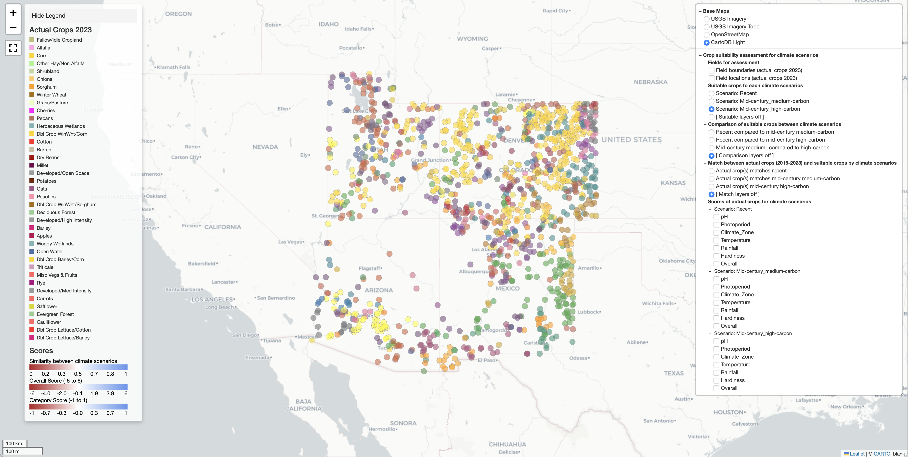
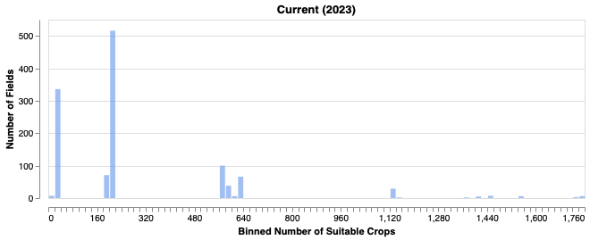
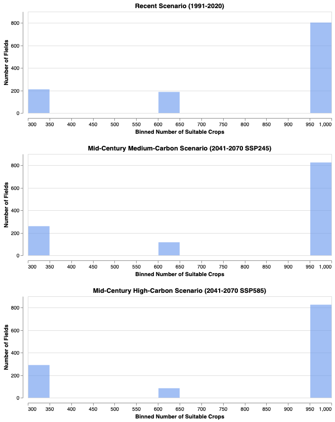
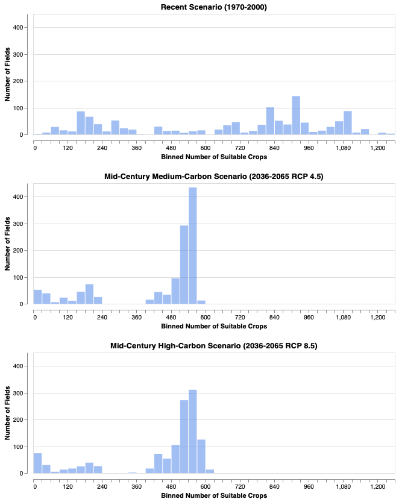
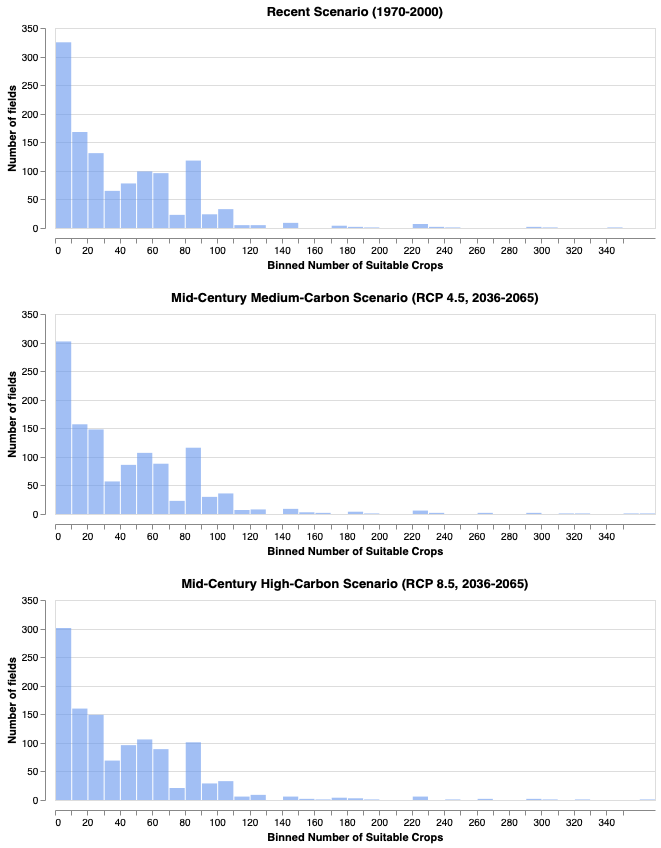

# Future Fields

Assessing crops for fields based on weather, water, sun, and soil: now and mid-century.

<!--  -->
<iframe src="https://future-fields.s3.amazonaws.com/20240818_200641_Actual_crop_score_breakdown_tree.html allowfullscreen></iframe>

## Summary

The most reliable predictor of what crop will be planted in a particular field for a growing season (the crop profile for the field) is what crops were planted in previous seasons.  However, climate change will force crop profiles into regimes outside of the historical context.

In general, the goals of the Future Fields Project are to enable discovery of new crop profiles that match the new climate reality of agricultural fields in the USA,  and to assess the suitability of current crop profiles for future climate scenarios. Overall, Future Fields reveals new agricultural patterns forced by climate change.

In practice, the Future Fields Project assesses the suitability of crops for fields in four states of the US Southwest for medium carbon and high carbon mid-century (2039 to 2065) climate scenarios. Each field in the [Crop Sequence Boundary](https://www.nass.usda.gov/Research_and_Science/Crop-Sequence-Boundaries/) 2016-2023 dataset was assessed for each crop in the [FAO EcoCrop database](https://gaez.fao.org/pages/ecocrop).

For each field and crop species, scores were calculated for:


* growing season
* temperature
* photoperiod
* rainfall
* soil pH
* Köppen-Geiger climate zone
* USDA Plant Hardiness Zone

Scores were calculated for three scenarios:


1. recent past (1970-2005)
2. mid-century medium carbon (2039-2065, RCP 4.5)
3. mid-century high carbon (2039-2065, RCP 8.5)

Scores were evaluated for each scenario and two crop categories:


1. The actual crop sequence 2016-2023
2. The set of best-scoring crops

Future Fields makes these comparisons:


* The best assessed crops for each climate scenario
* The match between the actual crops sequence grown during the 2016 to 2023 seasons (inclusive) and the best assessed crops for each scenario

Many fields in the Crop Sequence Boundary dataset are irrigated, but climate-dependent changes in ground and surface water sources are uncertain so fields are assessed without irrigation.  Thus, crops that are most suitable for un-irrigated fields will score highest in the Future Fields assessment.

More details, results and discussion are presented [here](http://github.com/jqwhite/future_fields):  http://github.com/jqwhite/future_fields


## Data sources


* **Agricultural field data (Crop Sequence Boundaries):** The [Crop Sequence Boundary](https://www.nass.usda.gov/Research_and_Science/Crop-Sequence-Boundaries/) file for the 2016-2023 growing seasons from the [National Agricultural Statistics Service](https://www.nass.usda.gov/i) [ ~[5.6Gb .zip file](https://www.nass.usda.gov/Research_and_Science/Crop-Sequence-Boundaries/datasets/NationalCSB_2016-2023_rev23.zip) ].  This dataset contains field location, shape, and attributes for agricultural fields in the Continental United States [ [CSB Viewer](https://www.nass.usda.gov/Research_and_Science/Crop-Sequence-Boundaries/Viewer/i) ] [1].
* **Crop characteristics data (EcoCrop):** The [EcoCrop Crop Database](https://gaez.fao.org/pages/ecocrop) [2–4].  The version for this study was combined from two sources: [EcoCrop-ScrapeR](https://github.com/supersistence/EcoCrop-ScrapeR) and [OpenClim](https://github.com/OpenCLIM/ecocrop) [2,3]. USDA plant hardiness zone data was scraped from the [Plants for a Future](https://pfaf.org/user/plantsearch.aspx) database [5]. The combined, cleaned, imputed dataset used for [Future Fields](https://github.com/jqwhite/future_fields/) is available as `EcoCrop_Complete.csv`.
* **Climate Zone Data:** [High-resolution (1 km) Köppen-Geiger maps for 1901–2099](https://figshare.com/articles/dataset/High-resolution_1_km_K_ppen-Geiger_maps_for_1901_2099_based_on_constrained_CMIP6_projections/21789074/1) based on constrained CMIP6 projections [[ ~90Mb .zip file](https://figshare.com/ndownloader/articles/21789074/versions/1) ] [6].
* **USDA Plant Hardiness Zone Data:**  Hardiness zone data for fields is from Climate Toolbox [Climate Mapper](https://climatetoolbox.org/tool/Climate-Mapper) datasets for recent and mid-century climate scenarios** **[7].  Hardiness zone data for crops were scraped from the [Plants for a Future](https://pfaf.org/user/plantsearch.aspx) database [5].
* **Climate data for temperature and growing season:** [The  Localized Constructed Analogs (LOCA) Derived Variables](https://atlas.globalchange.gov/pages/nca4archive) from the [4th National Climate Assessment](https://atlas.globalchange.gov/pages/nca4archive) [ [~2.8 Gb .zip file](https://downloads.globalchange.gov/scenarios/LOCA_data_all.tar.gz) ] [8,9].
* **Climate data for spring and summer temperature and precipitation:** The Climate Toolbox [Climate Mapper](https://climatetoolbox.org/tool/Climate-Mapper) datasets for mean and minimum summer temperatures, minimum annual temperatures, and annual precipitation for recent and mid-century climate scenarios** **[7].
* **Crop translator:** A translation file of Cropland Data Layer / Crop Sequence Boundary crop codes to likely EcoCrop species: `cdl_to_ecocrop_code_translator.csv`
* **Climate zone translator:** A translation file from Köppen-Geiger Climate Zones (Climate Model) to Trewartha Climate Zones (EcoCrop): `trewartha_to_koppen_geiger.txt` in the `data/ climate/zones/` folder.
* **Elevation:** Digital Elevation Model from the [PRISM Climate Group](https://prism.oregonstate.edu/downloads/) [ [835 Kb zip](https://prism.oregonstate.edu/downloads/data/PRISM_us_dem_4km_bil.zip) ] [10].
* **Soils:** [The Gridded National Soil Survey Geographic Database (gNATSGO)](https://www.nrcs.usda.gov/resources/data-and-reports/gridded-national-soil-survey-geographic-database-gnatsgo) [ [8Gb zip file](https://nrcs.app.box.com/v/soils/folder/233393842838) ] [11].


## System requirements

A `conda` environment with `python,` `xarray`, `rioxarray`, `dask`, `dask_geopandas`, `netcdf4`, `pandas`, `geopandas`, `altair`, `matplotlib`, `shapely`, `rasterio`,  and `folium`. 

A full example `conda` environment is provided in `requirements.txt`


## Jupyter Notebooks


<table>
  <tr>
   <td><strong>Notebook</strong>
   </td>
   <td><strong>Function</strong>
   </td>
  </tr>
  <tr>
   <td><code>CDL_to_ecocrop_crop_code_translator.ipynb</code>
   </td>
   <td>Translates Cropland Data Layer crop codes to EcoCrop crop species and index.
   </td>
  </tr>
  <tr>
   <td><code>CSB_geobalanced_sample.ipynb</code>
   </td>
   <td>Generates a geographically balanced sample of fields for Arizona, New Mexico, Utah, and Colorado and saves a geopandas dataframe as parquet file.
   </td>
  </tr>
  <tr>
   <td><code>CSB_state_extraction_all_states.ipynb</code>
   </td>
   <td>Extracts all crop sequence boundary data by state and territory and saves as parquet, geojson, and shapefiles. Extraction time is ~2 hours in an M1 iMac. 
   </td>
  </tr>
  <tr>
   <td><code>CSB_state_extraction_four_corners.ipynb</code>
   </td>
   <td>Extracts crop sequence boundary data for AZ, NM, CO and UT to a geopandas dataframe, and saves data as parquet files.
   </td>
  </tr>
  <tr>
   <td><code>EcoCrop_feature_names.ipynb</code>
   </td>
   <td>Inspection of EcoCrop variable (column) names from the <a href="https://github.com/OpenCLIM/ecocrop">OpenClim</a> download of the EcoCrop datase; mapping of column names to full explanation.
   </td>
  </tr>
  <tr>
   <td><code>EcoCrop_USDA_plant_hardiness_scrape.ipynb</code>
   </td>
   <td>Scrapes USDA Plant Hardiness scores from the <a href="https://pfaf.org/">Plants for a Future</a> database and adds it as a column to the <a href="https://github.com/OpenCLIM/ecocrop">OpenClim</a> download of the EcoCrop dataset.
   </td>
  </tr>
  <tr>
   <td><code>EcoCrop_DataCleaningCombined.ipynb</code>
   </td>
   <td>Combines <a href="https://github.com/OpenCLIM/ecocrop">OpenClim</a> and <a href="https://github.com/supersistence/EcoCrop-ScrapeR">EcoCrop-ScrapeR</a> datasets; contains scraped USDA Plant Hardiness scores. Generates <code>EcoCrop_Complete.csv</code>
   </td>
  </tr>
  <tr>
   <td><code>LOCA_variables.ipynb</code>
   </td>
   <td>Inspection of  Localized Constructed Analogs (LOCA) climate model variables; cleans columns.
   </td>
  </tr>
  <tr>
   <td><code>Scores_climate_zone.ipynb</code>
   </td>
   <td>Calculates the <code>Climate_Zone</code> score:
<p>
<code>scores/score_matrix_climate_zone.nc</code>
   </td>
  </tr>
  <tr>
   <td><code>Scores_temperature.ipynb</code>
   </td>
   <td>Calculates the <code>Temperature</code> score.
   </td>
  </tr>
  <tr>
   <td><code>Scores_photoperiod.ipynb</code>
   </td>
   <td>Calculates the <code>Photoperiod</code> score.
   </td>
  </tr>
  <tr>
   <td><code>Scores_precipitation.ipynb</code>
   </td>
   <td>Calculates the <code>Precipitation</code> score.
   </td>
  </tr>
  <tr>
   <td><code>Scores_usda_hardiness_zone.ipynb</code>
   </td>
   <td>Calculates the <code>Hardiness</code> score.
   </td>
  </tr>
  <tr>
   <td><code>Scores_soil_pH.ipynb</code>
   </td>
   <td>Calculates the <code>pH</code> score.
   </td>
  </tr>
  <tr>
   <td><code>Scores_overall_analysis_and_maps.ipynb</code>
   </td>
   <td>Calculates final score matrices: <code>score_matrix_overall_sum.nc</code> 
<p>
(in <code>../data/scores/</code>) 
<p>
and <code>score_matrix_stacked.nc</code>
<p>
(in <code>../datasets/scores/</code>), analyzes score distributions, and generates maps for analysis and deployment.
   </td>
  </tr>
</table>


## Methods

The project evaluated fields in the Four Corners states of the Southwest USA: Arizona, New Mexico, Colorado, and Utah. These states were selected because they have arid climates at high altitude, so it is anticipated they will be strongly affected by climate change [12].

Each field was evaluated for each crop.  For each scenario (recent, mid-century medium-carbon, and mid-century high-carbon) and field, crop combination, a score was calculated based on field characteristics and crop requirements. The scores were combined into a final score matrix, and the best-scoring crops are categorized as suitable crops for that field for that climate scenario.


### Climate scenarios

Scenarios from the Fourth National Climate Assessment [8]:

* “Historical Climate” product — Averages from 32 model simulations of the 1976–2005 climate, 1976-2005.
* “Lower Emissions” product — Averages from 32 model simulations under the Representative Concentration Pathway (RCP) 4.5 scenario, 2036-2065.
* “Higher Emissions” product — Averages from 32 model simulations under the RCP8.5 scenario, 2036-2065.

Scenarios from the Climate Toolbox Climate Mapper [7]: 

>“The scenarios come from the Fifth Coupled Model Inter-Comparison Project (CMIP5). The future emission scenarios are in terms of Representative Concentration Pathways (RCPs), which describe future scenarios of socioeconomic development that consider economic, demographic, technological and policy futures for the 21st century and beyond.”

The emission scenarios utilized here are:

* Historical simulations: modeled greenhouse gases and aerosols - mean of models for 1971-2000 
* Lower Emissions (RCP 4.5) : a future scenario of moderate climate policy (e.g., mitigation) - means for 2040-2069
* Higher Emissions (RCP 8.5): a high emissions scenario without strict climate policy- means for 2040-2069

Scenarios from Köppen-Geiger climate zone forecasts[6]:

>“The historical maps (encompassing[…]1991–2020) are based on high-resolution, observation-based climatologies. The future maps (encompassing 2041–2070 and 2071–2099) are based on downscaled and bias-corrected climate projections from the Coupled Model Intercomparison Project phase 6 (CMIP6) and cover seven Shared Socio-economic Pathways (SSPs). We evaluated 67 climate models and selected 42 with the most plausible CO2-induced warming rates to derive the future maps.[[Citation error]](http://127.0.0.1:8080/c/error)”


The emission scenarios utilized here are:

* Historical observations 1991-2020
* 2041-2070 SSP245 Projections 
* 2041-2070 SSP5855 Projections 


### Score calculations

Details are in the `Score_*.ipynb` notebooks for each score. In general, for each field, crop, scenario combination, the score was 

* -1 if the field conditions were obviously detrimental to the plant, 
* 0 if neutral or no data, and 
* +1 if the field conditions matched the plant’s requirement

A summary of each score calculation is provided below.


#### Soil pH

There is no available soil forecast for mid-century, and it is unclear how soil pH will change with climate, so the current pH values were used for all 3 scenarios: current/recent past and mid-century projections.The pH values for all soil data within a field boundary (shape) were averaged.  The average pH over the field was compared to the pH requirements for the crop (representative value measured in water, `ph1to1h2o_r`) and scored as follows:

* +1 if the field mean representative pH is within the optimal range.
* 0 if the field mean representative pH is within the absolute range but not in the optimal range.
* -1 if the field mean representative pH is outside the absolute range.

##### Soil pH score distribution for sample fields



#### Climate Zone

Köppen-Geiger climate zone data are from reference [6]. The Köppen-Geiger for each field and scenario was compared to the Trewartha climate zone of each crop using the mapping:

```
# Trewartha to Köppen–Geiger mapping
trewartha_to_koppen = {
    'Aw': ['Aw'],                  # Tropical wet & dry
    'Ar': ['Af', 'Am'],            # Tropical wet
    'Bs': ['BSh', 'BSk'],          # Steppe or semiarid
    'Cf': ['Cfa', 'Cfb', 'Cfc'],   # Subtropical humid
    'Cs': ['Csa', 'Csb', 'Csc'],   # Subtropical dry summer
    'Cw': ['Cwa', 'Cwb', 'Cwc'],   # Subtropical dry winter
    'Bw': ['BWh', 'BWk'],          # Desert or arid
    'Do': ['Cfb', 'Cfc'],          # Temperate oceanic
    'Dc': ['Dfa', 'Dfb', 'Dfc', 'Dfd'],  # Temperate continental
    'Df': ['Dfa', 'Dfb', 'Dfc', 'Dfd'],  # Temperate with humid winters
    'Dw': ['Dwa', 'Dwb', 'Dwc', 'Dwd'],  # Temperate with dry winters
    'E' : ['ET'],                  # Boreal
    'F' : ['EF']                   # Polar
}
```

Scoring: Does the field zone match the crop?  

* +1 if yes
* 0 if no (lack of a match is not necessarily detrimental)

##### Climate zone score distribution for sample fields





#### USDA Plant Hardiness zone

Plant hardiness zone projections for fields are from the Climate Toolbox Climate Mapper [7].  Hardiness zone data for crops are from the [Plants for a Future](https://pfaf.org/user/plantsearch.aspx) database [5].  Hardiness zones are more strict, so if the zone of the field does not match it is most likely detrimental to the crop. Does field match the crops USDA Plant Hardiness zone?

* 1 if yes
* 0 if  hardiness zone information is absent
* -1 if zone does not match

##### Hardiness zone score distribution for sample fields


#### Photoperiod

Photoperiod data for fields are derived from LOCA variables from the Fourth National Climate Assessment [8]. The photoperiod score takes several characteristics into account: field latitude (daylight hours) during the growing season (season centered on the last spring freeze and first fall freeze).

The photoperiod score was calculated in several steps.

1. **Find growing season length**: Look up 41F growing season by field location (latitude, longitude).
2. **Find the first and last days of the growing season:** Center the 41F growing season between last spring frost and first fall frost to find the start date and end date of the growing season. This step also takes into account the elevation 
3. **Check crop cycle fit:** Determine if the crop cycle fits within the growing season at that location of the field. That is, answer the question, is the growing season long enough for the crop to grow to harvest (the crop cycle)?
4. **Check available sunlight:** If the growing season is long enough for the crop, calculate the average daily sunlight for the field from the latitude of the field and the start and end days of the growing season.
5. **Check photoperiod requirements:** Compare the photoperiod estimate for the field latitude to the plant’s photoperiod requirements.

##### Photoperiod score distribution for sample fields

[Photoperiod Score Distributions](images/photoperiod_score_distributions.png "Photoperiod Score Distributions")


#### Temperature

Photoperiod data for fields are derived from LOCA variables from the Fourth National Climate Assessment [8]. The temperature score is calculated differently for annual and non-annual crops ( biennials and perennials).

1. Annual Crops:
* Check if the growing season is long enough for the crop cycle. If not, score = -1.
* Check if the minimum summer temperature is greater than the killing temperature for growth. If not, score = -1.
* If the average temperature during the growing season is outside of the absolute temperature range tolerated by the crop for growth, score = -1.
* If the average temperature during the growing season is  within the absolute temperature range for the crop,  but outside the optimal range, score = +0.5.
* If the average temperature during the growing season is within the optimal temperature range, score = +1.
* If no crop temperature characteristics are available, score 0.
1. Biennial and Perennial Crops:
* Check if the minimum annual temperature is greater than the killing temperature for rest.  If not, score = -1. (Cold will kill the crop over the winter).
* Otherwise, score as per annual crops.

##### Temperature score distribution for sample fields




#### Rainfall

Precipitation data for fields are from the Climate Toolbox Climate Mapper [7].  The score attempts to match the average rainfall during the spring and summer growing seasons to the crop requirement.

1. **Find rainfall during the growing season:** Find the total rainfall for each field for spring (March, April, May), and summer (June, July, August).
2. **Calculate an average daily rainfall** for spring and summer (1 March through 31 August; 184 days).
3. **Calculate the average crop cycle:** The average crop cycle is the mean of the minimum and maximum crop cycle  (`Crop_Cycle_Min + Crop_Cycle_Max)/2 = Crop_Cycle_Avg`).
4. **Calculate the total rainfall:** Total rainfall is given by (daily average x number of days), where the number of days is the **average crop cycle.**
5. **Check if rainfall is within crop range:** Is the total rainfall during this period is within the optimal rainfall range for the crop (between the `Rain_Opt_Min_In` and `Rain_Opt_Max_In`).
    * If yes, score = +1
    * If no, check to see if the total rainfall during this period is within the absolute rainfall range (between `Rain_Abs_Min_In` and `Rain_Abs_Max_In`).
    * If yes, score = 0.5
    * If no, score = 0

##### Rainfall score distribution for sample fields




## License information

The code here is provided under the MIT License. Details are in the `LICENSE` file. Terms-of-use for the data sources in this project are specified by the owners of the original data sources.  Refer to the citations for each data source. 


## References


1. 	Abernethy J, Beeson P, Boryan C, Hunt K, Sartore L. Preseason crop type prediction using crop sequence boundaries. Comput Electron Agric. 2023;208: 107768. doi:[10.1016/j.compag.2023.107768](http://dx.doi.org/10.1016/j.compag.2023.107768)


2. 	Brown M. ecocrop: Crop suitability model using the FAO EcoCrop crop characteristic database. Github; Available: [https://github.com/OpenCLIM/ecocrop](https://github.com/OpenCLIM/ecocrop)


3. 	Heaivilin H. EcoCrop-ScrapeR: Using R to scrape the FAO EcoCrop database. Github; Available: [https://github.com/supersistence/EcoCrop-ScrapeR](https://github.com/supersistence/EcoCrop-ScrapeR)


4. 	Food and Agricultural Organization of the United Nations. Crop ecological requirements database (ECOCROP). In: Food and Agricultural Organization of the United Nations | Land & Water | Land Resources Planning Toolbox [Internet]. 2015 [cited 10 Jun 2024]. Available: [https://www.fao.org/land-water/land/land-governance/land-resources-planning-toolbox/category/details/en/c/1027491/](https://www.fao.org/land-water/land/land-governance/land-resources-planning-toolbox/category/details/en/c/1027491/)


5. 	Chris Marsh, Paul Harding, Ed Sears and George Sobol. Plants for a Future Plant Database. In: Plants For A Future [Internet]. [cited 23 Aug 2024]. Available: [https://pfaf.org/](https://pfaf.org/)


6. 	Beck HE, McVicar TR, Vergopolan N, Berg A, Lutsko NJ, Dufour A, et al. High-resolution (1 km) Köppen-Geiger maps for 1901-2099 based on constrained CMIP6 projections. Sci Data. 2023;10: 724. doi:[10.1038/s41597-023-02549-6](http://dx.doi.org/10.1038/s41597-023-02549-6)


7. 	Hegewisch KCAJTA. “Climate Mapper” web tool. In: Climate Toolbox [Internet]. [cited 7 Aug 2024]. Available: [https://climatetoolbox.org/](https://climatetoolbox.org/)


8. 	U.S. Global Change Research Program (2009- ). Fourth National Climate Assessment: Impacts, Risks, and Adaptation in the United States. Summary findings and overview. U.S. Global Change Research Program; 2017. Available: [https://play.google.com/store/books/details?id=RlVFxwEACAAJ](https://play.google.com/store/books/details?id=RlVFxwEACAAJ)


9. 	U.S. Global Change Research Program (2009- ). Fourth National Climate Assessment: Impacts, risks, and adaptation in the United States. Report-in-brief. U.S. Global Change Research Program; 2018. Available: [https://play.google.com/store/books/details?id=l0cBvwEACAAJ](https://play.google.com/store/books/details?id=l0cBvwEACAAJ)


10.  PRISM Climate Group, Oregon State University. PRISM Spatial Climate Datasets for the Conterminous United States. 2014. Available: [https://prism.oregonstate.edu,](https://prism.oregonstate.edu,)

11.  Soil Survey Staff. _Soil Survey Staff. Gridded National Soil Survey Geographic (gNATSGO) Database for the Conterminous United States_. In: _United States Department of Agriculture, Natural Resources Conservation Service_ [Internet]. 19 Dec 2023 [cited 23 Aug 2024]. Available: [https://www.nrcs.usda.gov/resources/data-and-reports/gridded-national-soil-survey-geographic-database-gnatsgo](https://www.nrcs.usda.gov/resources/data-and-reports/gridded-national-soil-survey-geographic-database-gnatsgo)

12.  Gonzalez, P., G.M. Garfin, D.D. Breshears, K.M. Brooks, H.E. Brown, E.H. Elias, A. Gunasekara, N. Huntly, J.K. Maldonado, N.J. Mantua, H.G. Margolis, S. McAfee, B.R. Middleton, and B.H. Udall. 2018: Southwest. In: Reidmiller, D.R., C.W. Avery, D.R. Easterling, K.E. Kunkel, K.L.M. Lewis, T.K. Maycock, and B.C. Stewart, editor. Impacts, risks, and adaptation in the United States: Fourth national climate assessment, volume II. Washington DC: U.S. Global Change Research Program; 2018. pp. 1101–1184. Available: [https://nca2018.globalchange.gov/chapter/southwest](https://nca2018.globalchange.gov/chapter/southwest)
