<html>
<head>
    <meta content="text/html; charset=UTF-8" http-equiv="content-type">
    
</head>
<body class="c25 doc-content">
    

        Future Fields 
    

    

        Crop Suitability for Climate Scenarios
    

    

        Assessing crops for fields based on weather, water, sun, and soil: now and mid-century.
    

    

        Jamie White
    

    

        Team 6 - Future Fields
    

    

        jqwhite@umich.edu
    

    <h2 class="c18 c15" id="h.k3prgjdn8hos">
        Abstract
    </h2>
    

        The Future Fields project evaluates crop suitability under current and mid-century climate scenarios in the U.S. Southwest, focusing on Arizona, New Mexico, Utah, and Colorado. By analyzing 618,694 fields from the USDA Crop Sequence Boundary dataset (2016-2023) and 2,580 crops from the FAO EcoCrop database, the project assesses the impact of temperature, sunlight, rainfall, USDA hardiness zones, K&ouml;ppen-Geiger climate zones, and soil pH on crop viability. The analysis reveals discrepancies between current agricultural practices and the crops deemed most suitable for future climates, suggesting that factors such as economic considerations, land use restrictions, and irrigation practices strongly influence crop selection, potentially at the expense of optimizing crop suitability under changing conditions. The study also highlights the resilience of crop suitability across mid-century scenarios, indicating that adaptation strategies based on climate-dependent factors could be robust to varying levels of climate change. While the project provides valuable insights, it underscores the need for further research into the role of irrigation, land use changes, and economic factors in future crop viability. The findings serve as a foundation for refining crop suitability models and developing more comprehensive strategies for agricultural adaptation in response to climate change.
    

    <h2 class="c18 c15" id="h.pmtwvjy72iuf">
        Introduction
    </h2>
    

        The most reliable predictor of what crop will be planted in a particular field for a growing season (the crop profile for the field) is what crops were planted in previous seasons. &nbsp;However, climate change will force crop profiles into regimes outside of the historical context 
        
            <a class="c5" href="https://www.google.com/url?q=https://paperpile.com/c/lEs9Kr/BS8Lp%2BOghmd&amp;sa=D&amp;source=editors&amp;ust=1724807523530580&amp;usg=AOvVaw2qhMJJZeV3m1HbPgXnYjzU">[1,2]</a>
        
        . The goal of this project is to assess which crops are suitable for fields in the Southwest United States given the growth requirements of the crop and a set of climate-dependent conditions for the field: weather, water, sun, and soil.
    

    

        Specifically, Future Fields assesses the suitability of crops for fields in four states of the US Southwest for medium carbon and high carbon mid-century (2039 to 2065) climate scenarios. Each field in the 
        
            <a class="c5" href="https://www.google.com/url?q=https://www.nass.usda.gov/Research_and_Science/Crop-Sequence-Boundaries/&amp;sa=D&amp;source=editors&amp;ust=1724807523531005&amp;usg=AOvVaw3gd_P_i87Co6is5y4zQTu5">Crop Sequence Boundary</a>
        
        &nbsp;2016-2023 dataset for Arizona, New Mexico, Utah, and Colorado (618,694 fields) was assessed for each crop in the 
        
            <a class="c5" href="https://www.google.com/url?q=https://gaez.fao.org/pages/ecocrop&amp;sa=D&amp;source=editors&amp;ust=1724807523531185&amp;usg=AOvVaw1mCXEJHUW_SGRYnYfivG6z">FAO EcoCrop database</a>
        
        &nbsp;(2,580 species)
        . Scores were calculated for each field, crop combination based on climate-dependent features that have been modeled into the future: &nbsp;temperature, sunlight during the growth season, rainfall, USDA plant hardiness zone, and K&ouml;ppen-Geiger global climate zone. In addition, soil pH was selected to represent climate-independent soil characteristics of the field 
        
            <a class="c5" href="https://www.google.com/url?q=https://paperpile.com/c/lEs9Kr/mCF7&amp;sa=D&amp;source=editors&amp;ust=1724807523531391&amp;usg=AOvVaw0RFkVMZsnJLuj02veOCMp_">[3]</a>
        
        . 
        The six features were combined into an overall score to assess the suitability of the crop for the field given a climate scenario.
    

    

        Previous studies have focused on the impacts of climate change on a few, economically important crops 
        
            <a class="c5" href="https://www.google.com/url?q=https://paperpile.com/c/lEs9Kr/6OsW%2B7b1m&amp;sa=D&amp;source=editors&amp;ust=1724807523531668&amp;usg=AOvVaw2Jv9PgheHU56fin7nLy6dH">[4,5]</a>
        
        , or estimating the geographic changes in suitability for a single crop 
        
            <a class="c5" href="https://www.google.com/url?q=https://paperpile.com/c/lEs9Kr/GgeS&amp;sa=D&amp;source=editors&amp;ust=1724807523531829&amp;usg=AOvVaw2D3ETfSmO2X7rBTJoxpNJj">[6]</a>
        
        &nbsp;or a small subset of geographically selected crops 
        
            <a class="c5" href="https://www.google.com/url?q=https://paperpile.com/c/lEs9Kr/3sjl&amp;sa=D&amp;source=editors&amp;ust=1724807523531985&amp;usg=AOvVaw30bcvtck8pNxrmDxkgLkYo">[7]</a>
        
        .&nbsp;&nbsp;&nbsp;&nbsp;&nbsp;&nbsp;&nbsp;&nbsp;More comprehensive studies have focused on the regional or global suitability of a selected set of food, feed, fiber, and energy crops 
        
            <a class="c5" href="https://www.google.com/url?q=https://paperpile.com/c/lEs9Kr/GLAV%2B6b8a&amp;sa=D&amp;source=editors&amp;ust=1724807523532165&amp;usg=AOvVaw3-IfCAAVOLi0AxGxfO7k0u">[8,9]</a>
        
        . &nbsp;The emphasis of available studies seems to be evaluating the response of selected distributions to climate change, rather than discovery of alternative crops. 
    

    

        Thus, the goals of the Future Fields Project are not only to assess the suitability of existing crop profiles for future climate scenarios, but also to enable discovery of new crop profiles to match the new climate reality of agricultural fields in the USA. Current climate and soil conditions are useful tools for crop selection 
        
            <a class="c5" href="https://www.google.com/url?q=https://paperpile.com/c/lEs9Kr/B3cf&amp;sa=D&amp;source=editors&amp;ust=1724807523532451&amp;usg=AOvVaw13p5aaQvVOH3bckoTjs2fz">[10]</a>
        
        , so it is logical to extend suitability analysis to future climate scenarios. &nbsp;Overall, Future Fields reveals new agricultural patterns forced by global warming.
    

    <h2 class="c18 c15" id="h.fmquvvgc1ikj">
        Methods
    </h2>
    

        Datasets, sources, and methods are detailed in the 
        
            <a class="c5" href="https://www.google.com/url?q=https://github.com/jqwhite/future_fields/&amp;sa=D&amp;source=editors&amp;ust=1724807523532801&amp;usg=AOvVaw0jCsGGT_O5VcXMRLq0AC6B">Future Fields GitHub repository.</a>
        
        &nbsp;
    

    <h3 class="c29 c15" id="h.oiu3d5k5fwf9">
        Dataset rationale and 
        selection
    </h3>
    

        The overall goal of the project was to assess current and potential future crop growth conditions in order to provide insights for agricultural decision-making in the face of climate change. Thus, the source datasets for the project 
        represent
        
            &nbsp;fields in the US, a wide variety of crops, and two climate scenarios.
             
             
            For 
        
        fields
        , the USDA Crop Sequence Boundary 
        (CSB) 
        dataset was selected because it is a curated, authoritative representation of fields in the USA 
        
            <a class="c5" href="https://www.google.com/url?q=https://paperpile.com/c/lEs9Kr/DFr1&amp;sa=D&amp;source=editors&amp;ust=1724807523533357&amp;usg=AOvVaw2VsmrD0jy4UzdKxD19XxCA">[11]</a>
        
        . &nbsp;It contains the location of the field, the field boundary defined from satellite imagery, validated crop sequences for the past eight years, and various identifiers, for example state, county, and crop codes. 
    

    

        For crops, &nbsp;the EcoCrop dataset was selected because it represents a comprehensive, 
        curated
        &nbsp;catalog of crop characteristics 
        
            <a class="c5" href="https://www.google.com/url?q=https://paperpile.com/c/lEs9Kr/QcDw&amp;sa=D&amp;source=editors&amp;ust=1724807523533640&amp;usg=AOvVaw3FlLF7zNdP76xdpCMVCVBK">[12]</a>
        
        . &nbsp;The 
        
            <a class="c5" href="https://www.google.com/url?q=https://github.com/jqwhite/future_fields/blob/main/data/crops/EcoCrop_Complete.csv&amp;sa=D&amp;source=editors&amp;ust=1724807523533830&amp;usg=AOvVaw12eraEUQuVE5cCyLlCjZoN">Future Fields version</a>
        
        &nbsp;is a combined version of two variants available on GitHub 
        
            <a class="c5" href="https://www.google.com/url?q=https://paperpile.com/c/lEs9Kr/6b8a%2Bfjsr&amp;sa=D&amp;source=editors&amp;ust=1724807523533997&amp;usg=AOvVaw177hiNIvT7BOtuFr2GgQ6v">[9,13]</a>
        
        . &nbsp;Missing values were imputed from crops within the same genus or the 
        mean 
        of a set of crops clustered by similarity (
        agglomerative clustering)
        . 
        &nbsp;
    

    

        For climate projections, 
        datasets
        &nbsp;
        were selected to represent two scenarios: moderate mitigation and continued high emissions with limited mitigation. &nbsp;Mid-century projections were selected to provide a reasonable view of the near-term impacts of global warming on agricultural outcomes. Projections into the recent past provided a baseline and a basis for comparison to the actual crop sequences. Recent and mid-century climate scenarios were represented by 
    

    <ol class="c48 lst-kix_fb2xfw5dps6t-0 start" start="1">
        <li class="c12 c19 li-bullet-0">
            Localized Constructed Analogs (LOCA) datasets derived from the Fourth National Climate Assessment Representative Concentration Pathway 4.5 (RCP4.5; medium-carbon) or RCP 8.5 (high-carbon) projections 
            
                <a class="c5" href="https://www.google.com/url?q=https://paperpile.com/c/lEs9Kr/k6pg%2B2vSQ%2BfWbA&amp;sa=D&amp;source=editors&amp;ust=1724807523534559&amp;usg=AOvVaw348crQe6ZGHlO7POVPPx5K">[14&ndash;16]</a>
            
            , (growing season data).
        </li>
        <li class="c12 c19 li-bullet-0">
            Multivariate Adaptive Constructed Analogs (MACA) datasets based on a common set of 20 Coupled Model Intercomparison Project 5 (CMIP5) global climate models 
            
                <a class="c5" href="https://www.google.com/url?q=https://paperpile.com/c/lEs9Kr/7jOn%2ByH5i&amp;sa=D&amp;source=editors&amp;ust=1724807523534819&amp;usg=AOvVaw2wIP-HrWxaQ7KCHDl8VlXd">[17,18]</a>
            
            &nbsp;available from the 
            
                <a class="c5" href="https://www.google.com/url?q=https://climatetoolbox.org/tool/Climate-Mapper&amp;sa=D&amp;source=editors&amp;ust=1724807523534994&amp;usg=AOvVaw1kju6UR49Dn-pN3ikV0DXg">ClimateToolbox Climate Mapper</a>
            
            &nbsp;
            
                <a class="c5" href="https://www.google.com/url?q=https://paperpile.com/c/lEs9Kr/UZ8g&amp;sa=D&amp;source=editors&amp;ust=1724807523535187&amp;usg=AOvVaw20K5tTQuYkhI2uAKeehKLi">[19]</a>
            
            &nbsp;(rainfall, temperature, and USDA plant hardiness zone data).
        </li>
        <li class="c12 c19 li-bullet-0">
            Downscaled and bias-corrected climate projections from the Coupled Model Intercomparison Project phase 6 (CMIP6) 
            
                <a class="c5" href="https://www.google.com/url?q=https://paperpile.com/c/lEs9Kr/xbwr&amp;sa=D&amp;source=editors&amp;ust=1724807523535438&amp;usg=AOvVaw04uyaXvP9QIHTyXkc9a3g1">[20]</a>
            
            &nbsp; that take into account seven shared Socio-economic Pathways (SSPs) 
            
                <a class="c5" href="https://www.google.com/url?q=https://paperpile.com/c/lEs9Kr/73zn&amp;sa=D&amp;source=editors&amp;ust=1724807523535601&amp;usg=AOvVaw0Re7fDAc5D9iuLXzpdl9Wh">[21]</a>
            
            &nbsp;(K&ouml;ppen-Geiger climate zone projections for 2041-2070, datasets for ssp245 and ssp585 
            
                <a class="c5" href="https://www.google.com/url?q=https://paperpile.com/c/lEs9Kr/rxtO&amp;sa=D&amp;source=editors&amp;ust=1724807523535768&amp;usg=AOvVaw3dQuzk8lioeg2D7brR-_E_">[22]</a>
            
            , available from 
            
                <a class="c5" href="https://www.google.com/url?q=http://gloh2o.org&amp;sa=D&amp;source=editors&amp;ust=1724807523535924&amp;usg=AOvVaw1ZOu4fogCaCtIU-aynV5KG">gloh2o.org</a>
            
            &nbsp;
            
                <a class="c5" href="https://www.google.com/url?q=https://paperpile.com/c/lEs9Kr/LAlW&amp;sa=D&amp;source=editors&amp;ust=1724807523536098&amp;usg=AOvVaw3-q-caNvjqjHp8EQGNc3yJ">[23]</a>
            
            ).
        </li>
    </ol>
    

        In summary, the Future Fields mid-century medium-carbon scenarios were represented by datasets derived from RCP 4.5 and ssp245, and mid-century high-carbon scenarios were represented by datasets derived from RCP 8.5 and ssp585. &nbsp;The Future Fields recent scenarios were derived from the LOCA (1976-2005) or MACA (1979-2012) historical models, and from high-resolution, observation-based climatologies from 1991&ndash;2020 for the K&ouml;ppen-Geiger climate zones. &nbsp;
    

    <h3 class="c29 c15" id="h.d3o4w24alg85">
        Suitability scores
    </h3>
    

        Each field was evaluated for each crop. &nbsp;For each scenario (recent, mid-century medium-carbon, and mid-century high-carbon) and field, crop combination, a score was calculated based on field characteristics and crop requirements. &nbsp;The requirements encompassed a set of six critical environmental factors: soil pH, photoperiod, climate zone, temperature, rainfall, and hardiness. 
    

    

        These factors were chosen because they represent critical environmental influences on crop performance (growth and yield), and because they have been modeled for future climate scenarios. &nbsp;For example, temperature and rainfall determine the growing season and water availability. &nbsp;Soil pH is the exception: There is no available soil forecast for mid-century, and it is unclear how soil pH will change with climate 
        
            <a class="c5" href="https://www.google.com/url?q=https://paperpile.com/c/lEs9Kr/mCF7&amp;sa=D&amp;source=editors&amp;ust=1724807523536757&amp;usg=AOvVaw2x1Tut1q3xf1F1pcbTbk9U">[3]</a>
        
        , 
        so the current pH values from the Gridded National Soil Survey Geographic Database (gNATSGO) were used for all scenarios 
        
            <a class="c5" href="https://www.google.com/url?q=https://paperpile.com/c/lEs9Kr/GIj9&amp;sa=D&amp;source=editors&amp;ust=1724807523536970&amp;usg=AOvVaw0MKJXexpAOoCm4viKAcYtb">[24]</a>
        
        . &nbsp;The intent behind selection of these factors is that the suitability scores should reflect the key drivers of crop success in a climate-dependent manner. 
    

    

        The scores were combined into a final score matrix, and the best-scoring crops are categorized as suitable crops for that field for that climate scenario.
    

    <h3 class="c29 c15" id="h.msoqldkizu9f">
        Scoring actual 2016-2023 crop sequences
    </h3>
    

        Crop sequence boundary data standard crop codes (e.g. 12 &ldquo;Corn&rdquo;, 224 &ldquo;Strawberries&rdquo;) were mapped to EcoCrop crop species using typical crop species content of the CSB crop code. &nbsp;For example, CSB cod 228: &#39;Dbl Crop Triticale/Corn&#39; was assigned to &nbsp;&quot;Likely_Crop_Species&quot;: &#39;[&times; Triticosecale&#39;, &#39;Zea mays&#39;], with the reasoning: &quot;When a field has &#39;Dbl Crop Triticale/Corn&#39; growing in it, the species are most likely &times; Triticosecale (triticale) and Zea mays (corn). Double cropping involves growing two different crops in the same field in one year, usually triticale followed by corn&quot;. &nbsp;The 
        
            <a class="c5" href="https://www.google.com/url?q=https://github.com/jqwhite/future_fields/blob/main/data/crops/cdl_to_ecocrop_code_translator.csv&amp;sa=D&amp;source=editors&amp;ust=1724807523537425&amp;usg=AOvVaw02oKp1JMpGejck7o5K6tCR">mapping information</a>
        
        &nbsp;and 
        
            <a class="c5" href="https://www.google.com/url?q=https://github.com/jqwhite/future_fields/blob/main/notebooks/CDL_to_ecocrop_crop_code_translator.ipynb&amp;sa=D&amp;source=editors&amp;ust=1724807523537598&amp;usg=AOvVaw0HQSmFpPNMSaQPLlGvQQTr">strategy</a>
        
        &nbsp;is provided in the Future Fields GitHub repository.
    

    

        After mapping to EcoCrop crops, CSB cropsets were scored, and the highest scoring crop for each field, crop, scenario combination was selected for display and evaluation.
    

    <h3 class="c29 c15" id="h.xov1e2d0pod7">
        Comparisons
    </h3>
    

        Scores clustered into distinct sets. &nbsp;For the 1200 fields in the Four Corners sample data, there were 264 distinct cropsets for Recent, 212 for mid-century medium carbon, and 188 for mid-century high-carbon; the union of all three scenarios generated 541 unique cropsets. &nbsp;The unique cropsets were color-coded &nbsp;for visualization between scenarios.
    

    

        Cropsets for each field were compared between climate scenarios by computing the &nbsp;Jaccard Similarity between the sets..
    

    

        The actual cropsets for each field were compared to each climate scenario cropset by computing the Jaccard Similarity between the sets.
    

    <h3 class="c29 c15" id="h.8iburd1lada1">
        Analysis
    </h3>
    

        Score distributions were analyzed by plotting the actual score counts against the suitable score counts to display an overview of the score distributions and a comparison of actual and suitable within the same plots. Plots were generated in the 
        altair
        &nbsp;Python package.
    

    <h3 class="c29 c15" id="h.kspfxsr2er3o">
        Map display 
    </h3>
    

        Maps were generated in Python using the 
        folium
        &nbsp;package. &nbsp;Future Fields currently displays the &nbsp;following layers: 
    

    <ol class="c48 lst-kix_sdshw77x3xon-0 start" start="1">
        <li class="c12 c19 li-bullet-0">
            Field boundaries and locations
        </li>
        <li class="c12 c19 li-bullet-0">
            Suitable cropsets for each scenario (Recent, mid-century medium-carbon and mid-century high-carbon scenarios)
        </li>
        <li class="c12 c19 li-bullet-0">
            Comparison of suitable cropsets between climate scenarios
        </li>
        <li class="c12 c19 li-bullet-0">
            Comparison of actual 2016-2023 CSB cropsets to suitable cropsets for each scenario
        </li>
        <li class="c12 c19 li-bullet-0">
            Score breakdown and total score for the best-scoring crop from the actual 2016-2023 CSB cropsets. &nbsp;Color opacity is weighted according to score weight so the overlay of scores represents the composition of the total score.
        </li>
    </ol>
    

        A list of field attributes and the content of the crops being displayed are available as a popup for each field. 
    

    <h2 class="c18 c15" id="h.3adrkzf7tyk5">
        Results
    </h2>
    <h3 class="c29 c15" id="h.qba1x8rqi5er">
        Actual crops: 2023 growing season
    </h3>
    

        Crop sequences were visualized for a geographically balanced, representative set of 1200 fields in the Four Corners States (Arizona, New Mexico, Utah, and Colorado). &nbsp;There are several broad patterns in the 2023 actual cropsets revealed by the &ldquo;Field Locations&rdquo; view summarized in 
        
            <a class="c5" href="#fig_field_locations_view">Figure&nbsp;1</a>
        
        .
    

    <table class="c38">
        <tr class="c44">
            <td class="c34" colspan="1" rowspan="1">
                

                    
                        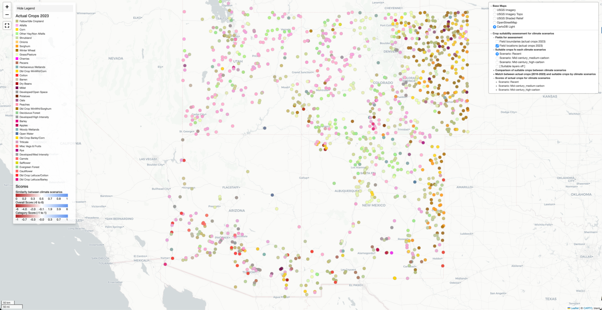
                    
                

                <h5 class="c10" id="h.486f1b1kaof6">
                    
                        <a class="c5" href="#figur_field_locations_view">Figure&nbsp;1</a>
                    
                    : Field Locations view
                </h5>
                

                    This view reveals general patterns of actual crop distributions for the 2023 growing season. &nbsp;For example, there is a pattern of corn, winter wheat and fallow cropland in the northeast corner of Colorado (brown/yellow/olive colored markers). &nbsp;Alfalfa is prominent and widely distributed (pink markers), as well as other hay/non-alfalfa crops (green). Cotton is distributed primarily in southwestern Arizona (red markers). The distribution of pecan orchards along the Rio Grande is discernible (light brown markers). 
                

                

                    Switching to a an imagery basemap or shaded relief basemap reveals that alfalfa and &ldquo;other hay/non-alfalfa&rdquo; grass crops are in valleys and foothills of the Rocky Mountains, and the corn, winter wheat and fallow cropland in northeast Colorado are in the high plains east of the Rockies.
                

            </td>
        </tr>
    </table>
    <h3 class="c29 c15" id="h.qtfj5zjva3me">
        Suitable crops
    </h3>
    

        There are similar broad patterns for the suitable crops. &nbsp;
        
            <a class="c5" href="#fig_suitable_recent">Figure&nbsp;2</a>
        
        &nbsp;describes patterns for the Recent scenario. &nbsp;Inspection of the contents of the suitable-recent cropset (using the popup on the map) suggests that the suitable crops are relevant. For example, suitable cropsets that contain grass species and low shrubs correlate with fields that grew winter wheat in the 2023 season. &nbsp;Suitable crops for the mid-century medium- and high-carbon scenarios show geographic patterns that are similar to one another and to the recent scenario, but inspection of the content of the mid-century suitable cropsets differs from the suitable-recent scenario and from one another (comparison analysis, below). &nbsp;
        
            <a class="c5" href="#fig_suitable_medium_high">Figure&nbsp;3</a>
        
        &nbsp;displays &nbsp;Overall, there are clear broad geographic patterns as well as smaller clusters of fields. 
    

    <table class="c38">
        <tr class="c3">
            <td class="c32" colspan="6" rowspan="1">
                

                    
                        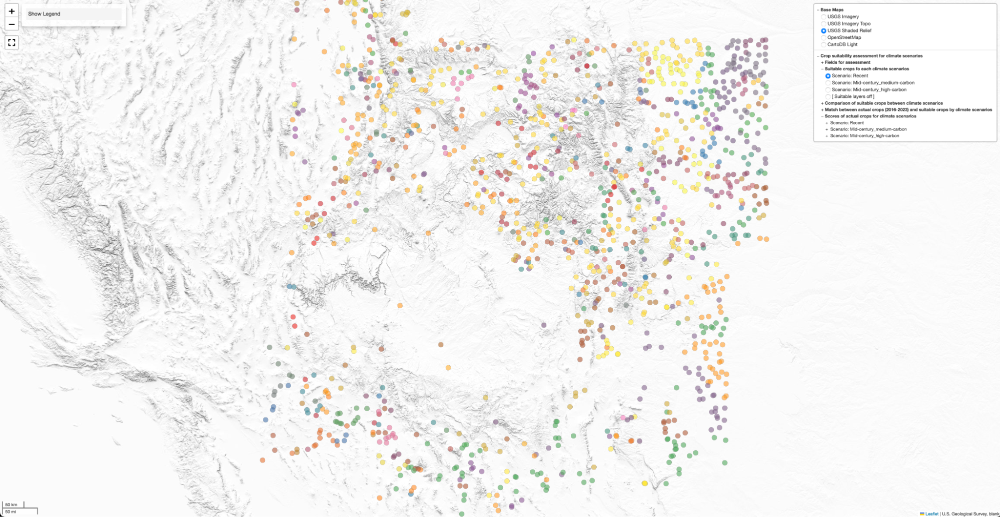
                    
                

                <h5 class="c31 c15" id="h.69v3br8lv0oa">
                    
                        <a class="c5" href="#figur_suitable_recent">Figure&nbsp;2</a>
                    
                    : Suitable crops for the recent scenario
                </h5>
                

                    This view reveals general patterns of suitable crop distributions roughly related to elevation. &nbsp;Inspection of the cropset contents using the popup feature of the map indicates that the suitable-recent cropsets seem relevant to the 2016-2023 actual crop sequences.
                

                

                    The dark purple suitable crop clusters in the northeast corner of Colorado contain wheatgrass, tufted grasses and trefoil, the lighter are different sets of wheatgrass. &nbsp;Most of these purple clusters correspond to the actual crops of fallow/idle cropland, sorghum, and winter wheat. The yellow crops at the foothills of the Rockies are alfalfa-containing clusters, as well as Mongolian Wheatgrass. &nbsp;Red locations at the base of the Rockies contain coriander, spinach, peashrub, and fennel; many of these suitable cropsets correspond to current alfalfa fields. &nbsp;Light brown locations in the Rocky Mountain foothills of southern Colorado and northern New Mexico indicate cropsets that contain rape, and often correspond to actual cropset categories &nbsp;of fallow/idle fields, alfalfa, and grass pasture. Silver locations in western Arizona often correspond to cotton fields, and indicate cropsets that contain vetiver grass and eucalyptus species, as well as eggplant. &nbsp;Similar cropsets at higher elevations (green). &nbsp;Yellow-orange locations on the eastern border of New Mexico indicate cropsets that contain a single species: 
                    Eragrostis lehmanniana
                    &nbsp;(Lehmann&rsquo;s love grass), a species that is used for grazing and cover. &nbsp;These Yellow-orange locations often correspond to Sorghum fields.
                

            </td>
        </tr>
        <tr class="c3">
            <td class="c26" colspan="3" rowspan="1">
                

                    
                        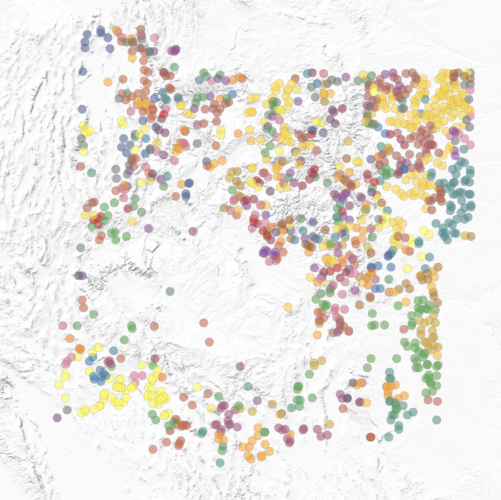
                    
                

                

                    Mid-century medium-carbon scenario 
                

            </td>
            <td class="c26" colspan="3" rowspan="1">
                

                    
                        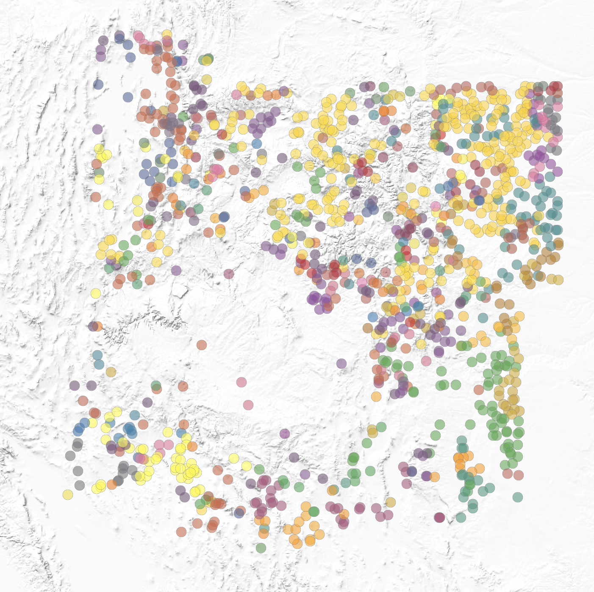
                    
                

                

                    Mid-century high-carbon scenario
                

            </td>
        </tr>
        <tr class="c3">
            <td class="c32" colspan="6" rowspan="1">
                <h5 class="c31 c15" id="h.aousscrktkxy">
                    
                        <a class="c5" href="#figur_suitable_medium_high">Figure&nbsp;3</a>
                    
                    : 
                    Suitable
                    &nbsp;cropset patterns for mid-century scenarios
                </h5>
                

                    The mid-century scenarios have similar geographic patterns of cropsets with similar but distinct crop contents.
                

            </td>
        </tr>
    </table>
    <h3 class="c29 c15" id="h.mvdlfnrpcpgi">
        Comparison of suitable crops between climate scenarios
    </h3>
    

        Suitable crops differ greatly between recent and mid-century scenarios, but the mid-century scenarios are similar (
        
            <a class="c5" href="#fig_scenario_comparisons">Figure&nbsp;4</a>
        
        ). &nbsp;Jaccard similarity between the different cropsets was calculated and assigned to a color scale where deep red indicates a score near 0 (different) and cornflower blue indicates a score near 1 (similar). &nbsp;In general, this observation demonstrates the profound change in field characteristics as global warming progresses, and indicates that the medium-carbon scenario is not much better than the high-carbon scenario. &nbsp;
    

    <table class="c38">
        <tr class="c44">
            <td class="c7" colspan="1" rowspan="1">
                

                    
                        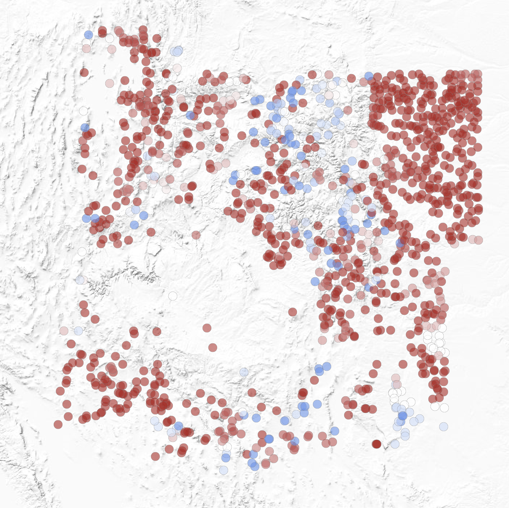
                    
                

                

                    [ 0
                    
                        
                    
                    1 ]
                

                

                    
                        Recent compared to 
                         
                        mid-century medium
                    
                

            </td>
            <td class="c7" colspan="1" rowspan="1">
                

                    
                        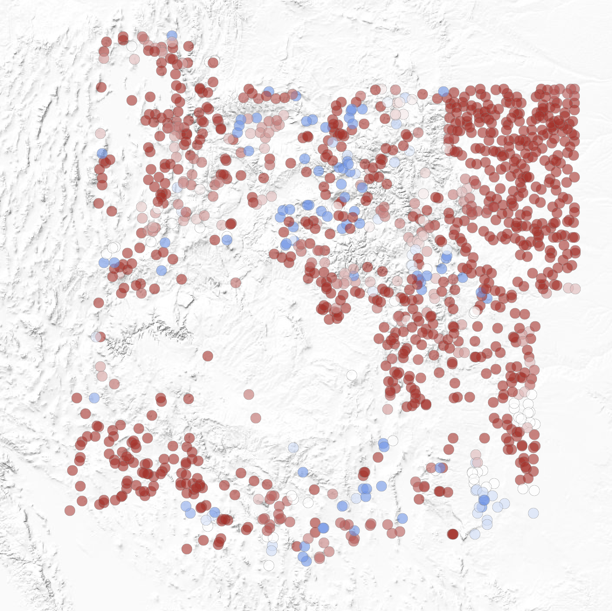
                    
                

                

                    [ 0
                    
                        
                    
                    1 ]
                

                

                    
                        Recent compared to 
                         
                        mid-century medium-carbon
                    
                

            </td>
            <td class="c7" colspan="1" rowspan="1">
                

                    
                        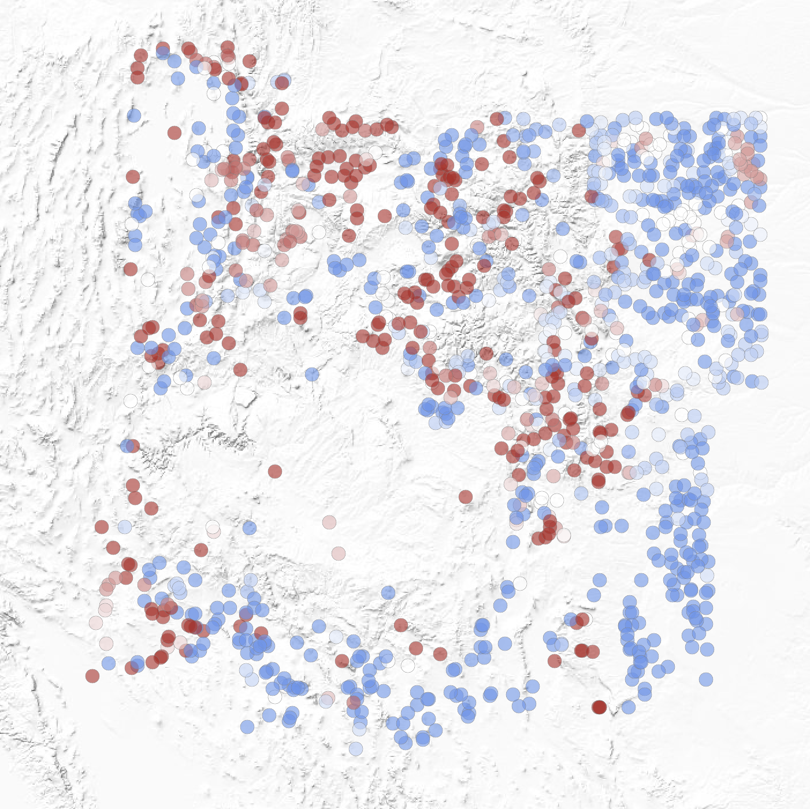
                    
                

                

                    [ 0
                    
                        
                    
                    1 ]
                

                

                    Mid-century medium- compared to mid-century high-carbon
                

            </td>
        </tr>
        <tr class="c3">
            <td class="c32" colspan="3" rowspan="1">
                

                    
                        <a class="c5" href="#figur_scenario_comparisons">Figure&nbsp;4</a>
                    
                    : &nbsp;Suitable crops differ greatly between recent and mid-century scenarios, but the mid-century scenarios are similar.
                

            </td>
        </tr>
    </table>
    <h3 class="c29 c15" id="h.bn78o4jhmjsw">
        The match between actual crop profiles and suitable cropsets
    </h3>
    

        Inspection of the actual crop from 2023 and the suitable cropset contents using the popup feature on the map suggests that the suitable cropsets are relevant to the actual crop content of the field. &nbsp;To investigate this relation more thoroughly, the actual crop profile was compared to the suitable cropset for every field and scenario. &nbsp;The actual crop profile takes into account that different crops might be planted in different seasons in the same field. The CSB dataset contains crop sequences from 2016 to 2023. &nbsp;The full set of crops from these seasons was combined into an overall actual crop profile, and these multiseason crop profiles were compared to the suitable cropsets for each scenario (
        
            <a class="c5" href="#fig_actual_compared_to_suitable">Figure&nbsp;5</a>
        
        ). Because the actual crop profiles and suitable cropsets were derived differently, Jaccard Similarity was not appropriate, so a simple assessment was made: whether 
        any
        &nbsp;of the actual crops were contained within the suitable cropset. &nbsp;This analysis demonstrates that, although the content appears relevant on manual inspection, in most cases the suitable cropsets do not contain crops from the actual profiles.
    

    <table class="c38">
        <tr class="c44">
            <td class="c7" colspan="1" rowspan="1">
                

                    
                        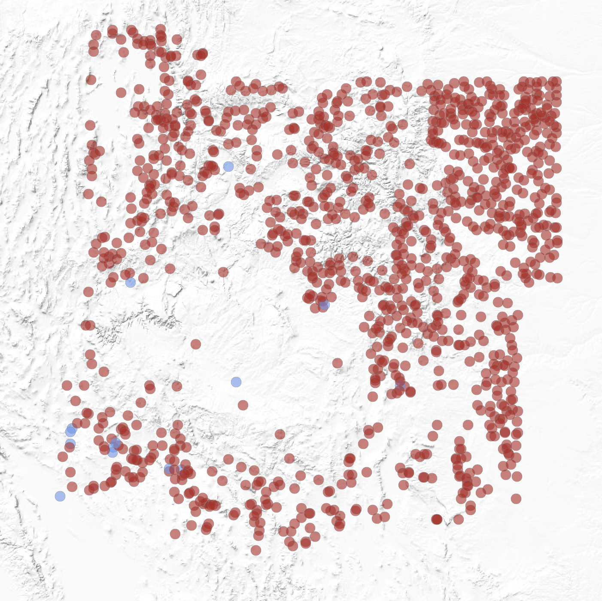
                    
                

                

                    
                        Actual crop profile compared to 
                         
                        recent scenario cropsets
                    
                

            </td>
            <td class="c7" colspan="1" rowspan="1">
                

                    
                        
                    
                

                

                    
                        Actual crop profile compared to 
                         
                        mid-century medium-carbon cropsets
                    
                

            </td>
            <td class="c7" colspan="1" rowspan="1">
                

                    
                        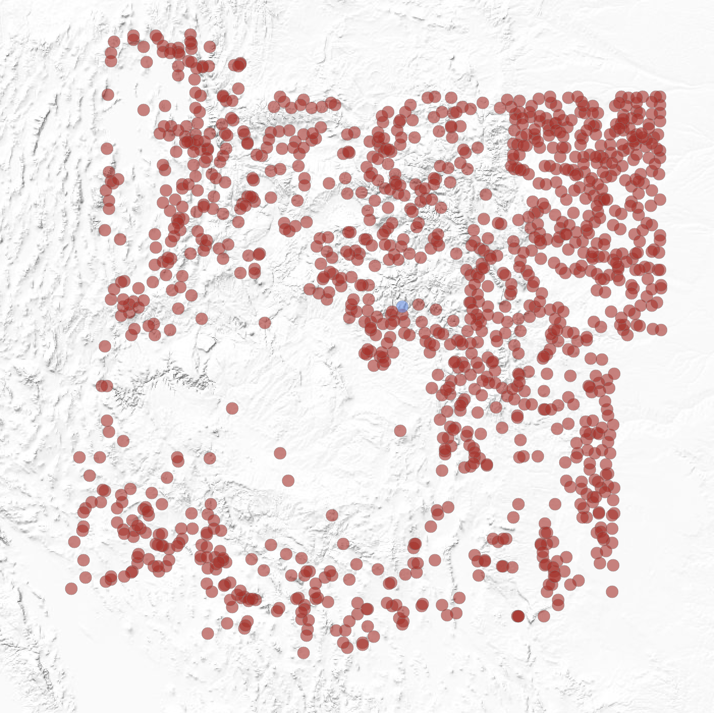
                    
                

                

                    
                        Actual crop profile compared to
                         
                        mid-century high-carbon cropsets
                    
                

            </td>
        </tr>
        <tr class="c3">
            <td class="c32" colspan="3" rowspan="1">
                <h5 class="c31" id="h.jmgc84k20r61">
                    
                        <a class="c5" href="#figur_actual_compared_to_suitable">Figure&nbsp;5</a>
                    
                    : Comparison of actual crop profiles from 2016-2023 to suitable cropsets
                </h5>
                

                    Although the content of the suitable cropsets appear relevant upon manual inspection (
                    
                        <a class="c5" href="https://www.google.com/url?q=https://docs.google.com/document/d/1k7y55sEyXIt2PY0MbmobFnyYh7Gh_6XKnYj1g1wZNM4/edit?pli%3D1%23fig_suitable_recent&amp;sa=D&amp;source=editors&amp;ust=1724807523547243&amp;usg=AOvVaw06sm6z1mYa-O2mbu-uV7kQ">Figure&nbsp;2</a>
                    
                    ), in most cases the suitable cropsets do not contain crops from the actual profiles.
                

            </td>
        </tr>
    </table>
    <h3 class="c29 c15" id="h.hxx566b908dr">
        Suitability scores of actual crops from the 2016-2023 seasons
    </h3>
    

        The apparent mismatch between the actual crop profiles and the suitable cropsets, especially for the recent scenario (which would be expected to match 2016-2023 conditions, assuming the models are valid) prompted a more thorough investigation of the actual crop profile scores (
        
            <a class="c5" href="#fig_actual_score_breakdown">Figure&nbsp;6</a>
        
        ). Most crops are moderately well-suited to their corresponding field (light to medium blue), but based on their overall score they are not as well-suited to their fields as the most suitable cropsets for each scenario. &nbsp;The most suitable cropsets for each climate scenario have average scores near 1 (most suitable) and so were not plotted (the plots would be all blue). &nbsp;The individual scores for the actual crops indicate that &nbsp;soil pH and rainfall are mostly neutral (score near 0, transparent marker fill). Temperature and photoperiod show a substantial number of fields are mismatch to their crop (score below 0, red), and in the same geographic regions (north and north-central Utah and western Colorado). &nbsp;Hardiness and K&ouml;ppen-Geiger climate zone scores show a geographic pattern that is complementary to the photoperiod and temperature scores, suggesting they consolidate features beyond a more simple characteristic such as temperature or average light. &nbsp;They are themselves a sort of suitability score. Thus, although the actual crops are not the most suitable, they may grow well enough that they are a reasonable selection for a field based on features other than plant growth characteristics: economic considerations, for example. &nbsp;Overall, the observation that the actual crops are not the most suitable when scored by plant growth requirements indicates that the Future Fields suitable cropsets may offer reasonable suggestions for alternative crops, if global warming forces crop
    

    <table class="c38">
        <tr class="c44">
            <td class="c7" colspan="1" rowspan="1">
                

                    
                        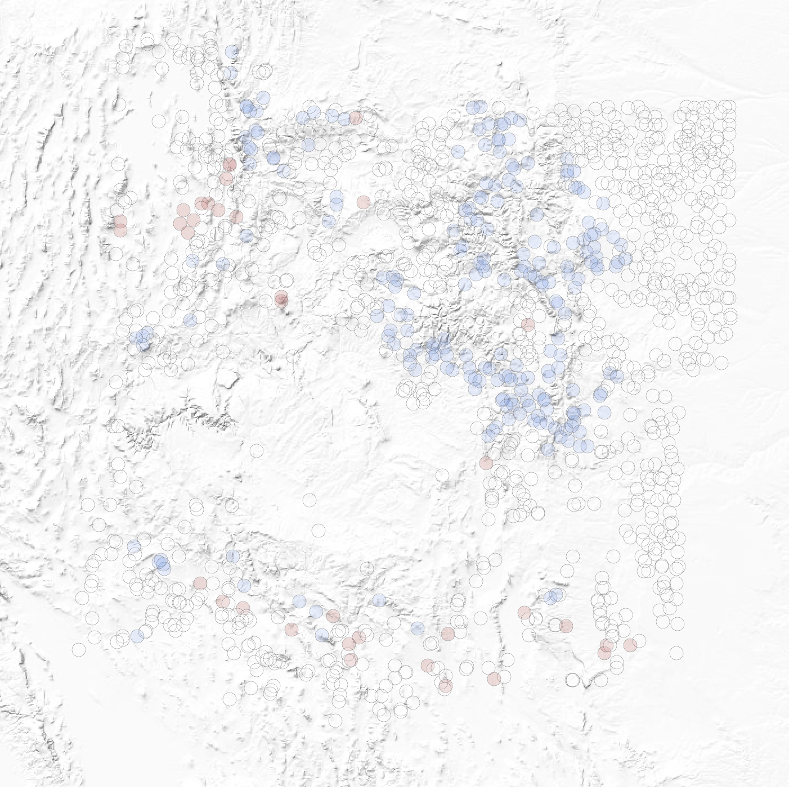
                    
                

                

                    Soil pH
                

            </td>
            <td class="c7" colspan="1" rowspan="1">
                

                    
                        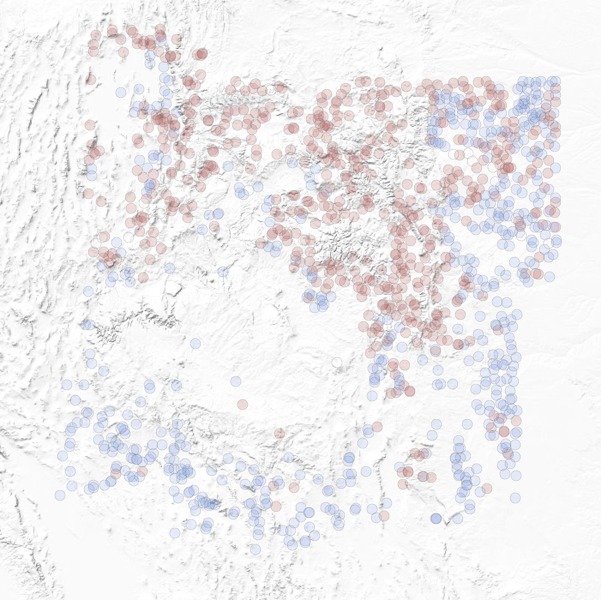
                    
                

                

                    Photoperiod
                

            </td>
            <td class="c7" colspan="1" rowspan="1">
                

                    
                        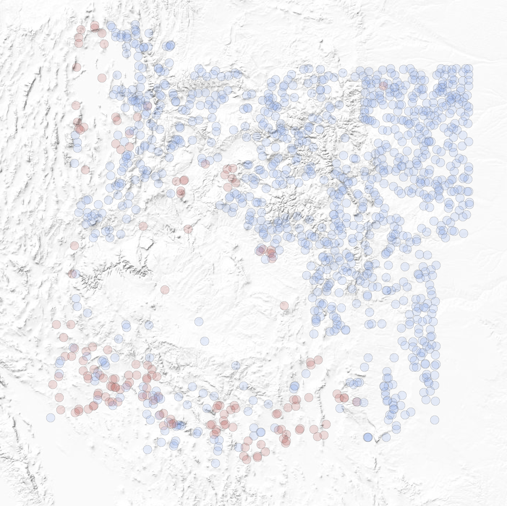
                    
                

                

                    Climate Zone
                

            </td>
        </tr>
        <tr class="c3">
            <td class="c7" colspan="1" rowspan="1">
                

                    
                        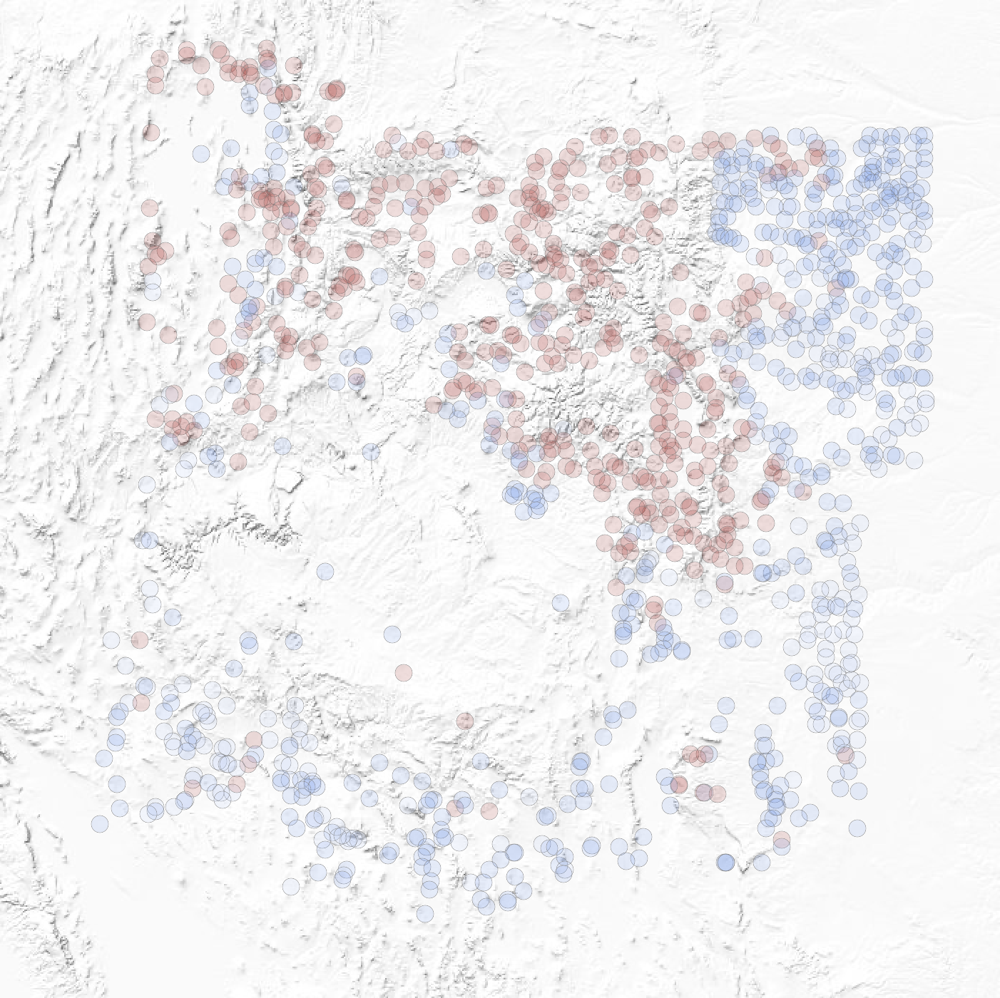
                    
                

                

                    Temperature
                

            </td>
            <td class="c7" colspan="1" rowspan="1">
                

                    
                        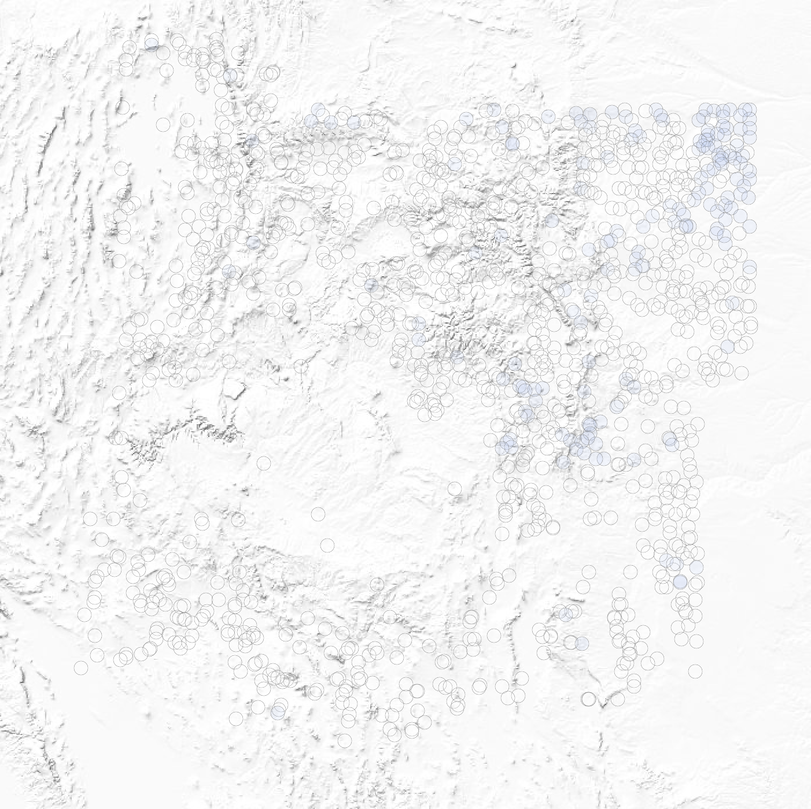
                    
                

                

                    Rainfall
                

            </td>
            <td class="c7" colspan="1" rowspan="1">
                

                    
                        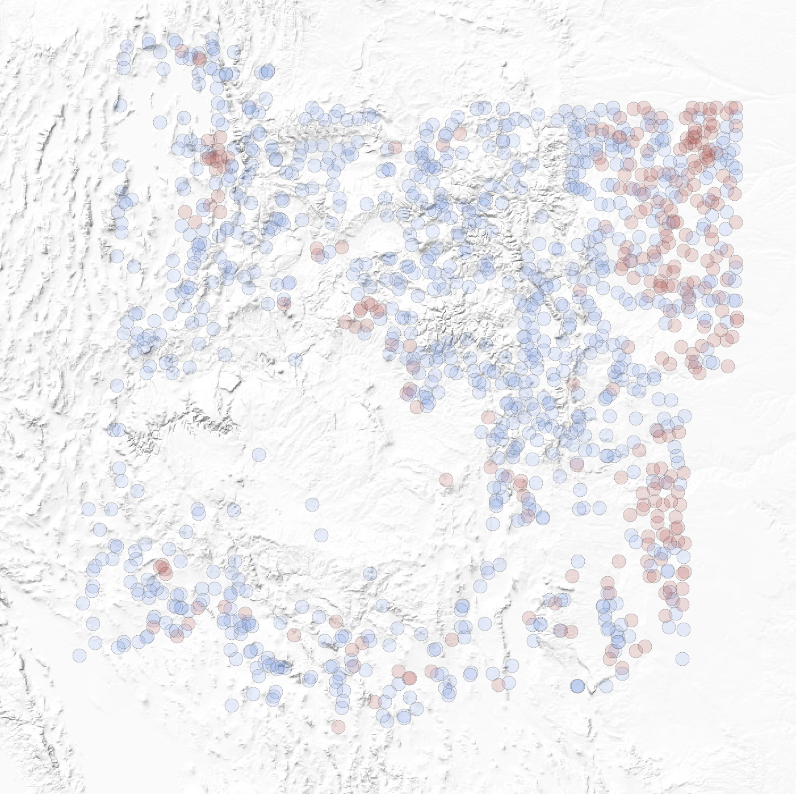
                    
                

                

                    Hardiness
                

            </td>
        </tr>
        <tr class="c3">
            <td class="c32" colspan="3" rowspan="1">
                

                    
                        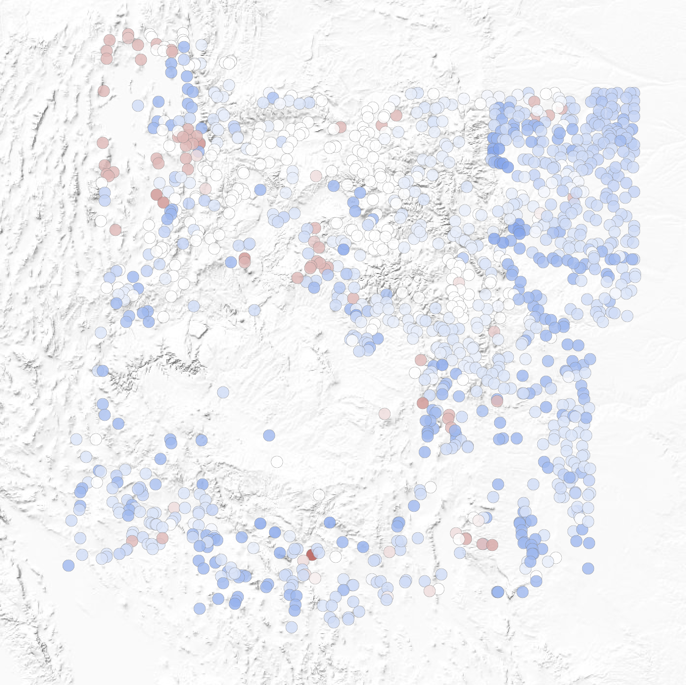
                    
                

                

                    [ 0 
                    
                        
                    
                    1]
                

                

                    Overall 
                

            </td>
        </tr>
        <tr class="c3">
            <td class="c32" colspan="3" rowspan="1">
                <h5 class="c15 c31" id="h.c01yk6eci54z">
                    
                        <a class="c5" href="#figur_actual_score_breakdown">Figure&nbsp;6</a>
                    
                    : Score breakdown of the best-scoring actual crop from the 2016-2023 crop profile
                </h5>
                

                    Most actual crops &nbsp;are moderately well-suited to their field, but they are not as well-suited to their fields as the most suitable (overall). &nbsp;The overall scores for the most well-suited crops 
                

            </td>
        </tr>
    </table>
    <h3 class="c15 c29" id="h.w8xa9d98avqf">
        Score distributions: actual and suitable crop scores 
    </h3>
    

        The differences observed between actual crop scores and the suitable cropset scores, especially for the recent scenario, prompted a more thorough investigation of the score distributions. &nbsp;
        
            <a class="c5" href="#fig_score_distribution_breakdown">Figure&nbsp;7</a>
        
        &nbsp;displays the relative score distributions. &nbsp;Inspection of the score categories provides an indication of the selectivity of each suitability score. &nbsp;For example, the climate zone scores were predominantly 1 for the suitable crops and evenly split between -1 and +1, showing that the climate zone score was moderately selective. In other words, for all the suitable crops that had a score of 1, the actual scores were evenly split between -1 and 1. 
    

    

        These plots hint that the rainfall score might account for the observation that almost none of the actual crops are in the suitable cropsets: for all suitable scores of +1, the actual scores are split between 0 and +0.5, and for the actual scores of +1, there are no rainfall scores above 0. However, re-calculating overall suitability scores without the rainfall category did not obviously improve the overlap between actual and suitable cropsets (not shown), so the difference in overlap is likely more complex. 
    

    

        The distributions of the overall scores provide a hint: there were very few actual crops that achieved a maximum overall score of +6, whereas a reasonable number of EcoCrop species achieved the overall maximum score. It may be that expanding the suitable crops to the top 20% of overall scores would improve the overlap between actual and suitable, because the suitable crops could include species with a 5/6 score and allowing for the possibility that the actual crop would make the cut into the suitable cropset. 
    

    <table class="c38">
        <tr class="c46">
            <td class="c32" colspan="1" rowspan="1">
                

                    
                        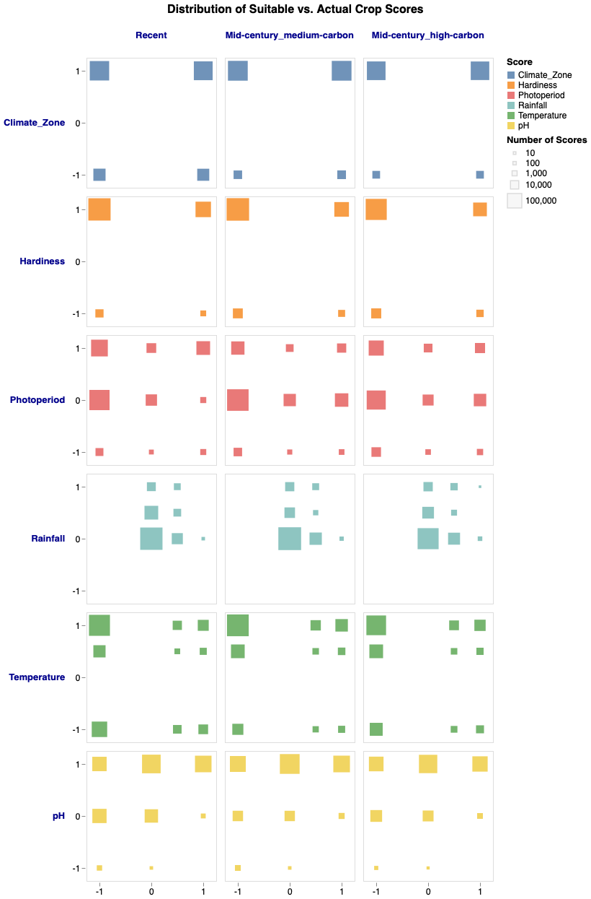
                    
                

                

                    &uarr; 
                    Suitable score
                    &nbsp;| &rarr; 
                    Actual score
                

                

                    (Individual scores)
                

            </td>
        </tr>
        <tr class="c44">
            <td class="c32" colspan="1" rowspan="1">
                

                    
                        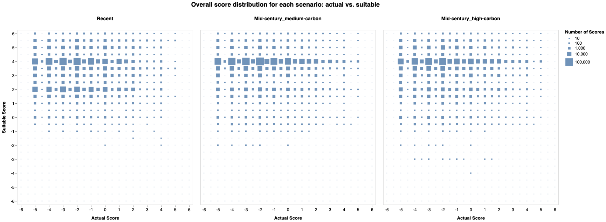
                    
                

                

                    &uarr; 
                    Suitable score
                    &nbsp;| &rarr; 
                    Actual score
                

                

                    (Overall scores)
                

            </td>
        </tr>
        <tr class="c44">
            <td class="c32" colspan="1" rowspan="1">
                

                    
                        <a class="c5" href="#figur_score_distribution_breakdown">Figure&nbsp;7</a>
                    
                    : Suitable vs relative score distribution for all scores in the field sample dataset
                

                

                    The relative score distributions for all 3,081,600 scores from the sample field dataset is displayed in two dimensions. The abscissa show the actual crop scores and the ordinate shows the suitable crop cores. The top set of panels shows score breakdown and the bottom panel shows the overall scores for each scenario (y-axis) compared to the actual scores. 
                

            </td>
        </tr>
    </table>
    <h2 class="c18 c15" id="h.brl8pk2tbz58">
        Discussion
    </h2>
    

        The Future Fields project embodies a comprehensive evaluation of crop suitability under two near-future climate scenarios in the U.S. Southwest to provide insights into how agriculture might adapt to a changing climate. One unexpected finding is the discrepancy between actual crop sequences from 2016-2023 and the crops deemed most suitable under both current and projected mid-century climate conditions. One explanation for the divergence may be that factors beyond straightforward suitability scores&ndash;such as economic considerations, land use restrictions, and irrigation practices&ndash;strongly influence crop selection. &nbsp;Alternatively, current agricultural practices may simply not be optimized for crop requirements, especially under changing climate conditions. &nbsp;For instance, while actual crops like corn, winter wheat, and alfalfa are widespread, they do not always align with the highest suitability scores, particularly in regions where temperature and photoperiod scores indicate potential mismatches. Finally, the discrepancy could be due to the influence of factors like irrigation, which is not accounted for in the suitability model but supports crop viability in arid and semi-arid regions.
    

    

        The analysis reveals that the mid-century scenarios, regardless of carbon intensity, generate similar patterns of suitable crops. &nbsp;This result indicates that even moderate mitigation efforts may not sufficiently alter the trajectory of climate change&rsquo;s impact on agriculture. More generally, this finding raises concerns about the resilience of agricultural systems and the need for more robust adaptation strategies. &nbsp;However, the similarity between mid-century scenarios suggests that if an alternate crop sequence is selected for cultivation, it will be robust to the more extreme of the two scenarios. &nbsp;That is, crop sequences will most likely need to change to match new climate realities, but if the change is guided by climate-dependent factors, the change will be insensitive to the precise climate outcome mid-century. Crop suitability analysis for long-term future projections may further inform the selection of alternative crops. 
    

    

        A key observation from the study is the role of integrated climate scores, such as the K&ouml;ppen-Geiger climate zone and USDA plant hardiness zone, in predicting crop suitability. These scores, which encapsulate a range of environmental factors, provide a more nuanced understanding of crop-environment interactions than individual factors like temperature or rainfall alone. However, the findings also highlight the need for further refinement of these scores to better capture the complex dynamics of crop suitability under future climate scenarios.
    

    

        Looking forward, the Future Fields project lays the groundwork for several avenues of further investigation. Currently, Future Fields does not take into consideration land use changes: urbanization, de-urbanization, and land viability changes. It also does not take into account irrigation and changes in water availablility, eithe through groundwater depletion or surface water changes. Integrating these additional variables should provide a more accurate, more realistic assessment of future agricultural potential. Additionally, exploring the economic and logistical factors that influence crop selection, would offer a more comprehensive &nbsp;understanding of how agriculture might adapt to future challenges. Finally, the project&rsquo;s methodology might also be extended to other regions and crops, providing valuable insights for global agricultural adaptation strategies.
    

    <h2 class="c15 c18" id="h.54wu54pobsd2">
        Statement of work
    </h2>
    

        The Future Fields Project was conceived and implemented by Jamie White (jqwhite@umich.edu). Data curation, analysis, algorithms, and approaches were performed by him. Python code was written by ChatGPT-4/4.0 or GitHub Copilot and edited for use by Jamie White. Writing and analysis by Jamie White. Errors and omissions are solely his.
    

    <h2 class="c18 c15" id="h.ez0tr3ldv3x7">
        Acknowledgments
    </h2>
    

        I wish to thank Dr. Elle O&#39;Brien, University of Michigan School of Information for her guidance, wisdom and encouragement. &nbsp;I also wish to thank Rachel Wyatt (UMSI) for guidance, wisdom and encouragement, and for catalyzing the initial stages of this project. &nbsp;I thank my fellow Capstone classmates in the UMSI MADS Program for their feedback, input, and encouragement. &nbsp;Finally, I wish to dedicate my efforts to Maggie: I did not deserve you.
    

    <h2 class="c18 c15" id="h.9e9tu0gixsom">
        References
    </h2>
    

        1. &nbsp;&nbsp;&nbsp;&nbsp;&nbsp;&nbsp;&nbsp;&nbsp;
        
            <a class="c5" href="https://www.google.com/url?q=http://paperpile.com/b/lEs9Kr/BS8Lp&amp;sa=D&amp;source=editors&amp;ust=1724807523554419&amp;usg=AOvVaw1Pd1jywUI97yaH7GdKzdm1">Gonzalez, P., G.M. Garfin, D.D. Breshears, K.M. Brooks, H.E. Brown, E.H. Elias, A. Gunasekara, N. Huntly, J.K. Maldonado, N.J. Mantua, H.G. Margolis, S. McAfee, B.R. Middleton, and B.H. Udall. 2018: Southwest. In: Reidmiller, D.R., C.W. Avery, D.R. Easterling, K.E. Kunkel, K.L.M. Lewis, T.K. Maycock, and B.C. Stewart, editor. Impacts, risks, and adaptation in the United States: Fourth national climate assessment, volume II. Washington DC: U.S. Global Change Research Program; 2018. pp. 1101&ndash;1184. Available: </a>
        
        
            <a class="c5" href="https://www.google.com/url?q=https://nca2018.globalchange.gov/chapter/southwest&amp;sa=D&amp;source=editors&amp;ust=1724807523554709&amp;usg=AOvVaw1ab228OXmF8wel8IoXsn2a">https://nca2018.globalchange.gov/chapter/southwest</a>
        
    

    

        2. &nbsp;&nbsp;&nbsp;&nbsp;&nbsp;&nbsp;&nbsp;&nbsp;
        
            <a class="c5" href="https://www.google.com/url?q=http://paperpile.com/b/lEs9Kr/Oghmd&amp;sa=D&amp;source=editors&amp;ust=1724807523554935&amp;usg=AOvVaw0YySTbmn5uLacRrNwlJnkX">U.S. Global Change Research Program (2009- ). Fourth National Climate Assessment: Impacts, risks, and adaptation in the United States. Report-in-brief. U.S. Global Change Research Program; 2018. Available: </a>
        
        
            <a class="c5" href="https://www.google.com/url?q=https://play.google.com/store/books/details?id%3Dl0cBvwEACAAJ&amp;sa=D&amp;source=editors&amp;ust=1724807523555141&amp;usg=AOvVaw3LyzcDNByvLYmLiTqmKMGY">https://play.google.com/store/books/details?id=l0cBvwEACAAJ</a>
        
    

    

        3. &nbsp;&nbsp;&nbsp;&nbsp;&nbsp;&nbsp;&nbsp;&nbsp;
        
            <a class="c5" href="https://www.google.com/url?q=http://paperpile.com/b/lEs9Kr/mCF7&amp;sa=D&amp;source=editors&amp;ust=1724807523555375&amp;usg=AOvVaw3Atet5v9VVM4R521E_BmOS">Tripathi A, Pandey V, Ranjan MR. Climate change and its impact on soil properties. Soil Biology. Cham: Springer International Publishing; 2021. pp. 139&ndash;153. doi:</a>
        
        
            <a class="c5" href="https://www.google.com/url?q=http://dx.doi.org/10.1007/978-3-030-76863-8_7&amp;sa=D&amp;source=editors&amp;ust=1724807523555508&amp;usg=AOvVaw0WT03mT14p5bBZyAuNva3C">10.1007/978-3-030-76863-8_7</a>
        
    

    

        4. &nbsp;&nbsp;&nbsp;&nbsp;&nbsp;&nbsp;&nbsp;&nbsp;
        
            <a class="c5" href="https://www.google.com/url?q=http://paperpile.com/b/lEs9Kr/6OsW&amp;sa=D&amp;source=editors&amp;ust=1724807523555699&amp;usg=AOvVaw0lu0CuIqHZoGAeRtl6n7xr">J&auml;germeyr J, M&uuml;ller C, Ruane AC, Elliott J, Balkovic J, Castillo O, et al. Climate impacts on global agriculture emerge earlier in new generation of climate and crop models. Nat Food. 2021;2: 873&ndash;885. doi:</a>
        
        
            <a class="c5" href="https://www.google.com/url?q=http://dx.doi.org/10.1038/s43016-021-00400-y&amp;sa=D&amp;source=editors&amp;ust=1724807523555814&amp;usg=AOvVaw1Wcr5GhhLQQNWv5mYT4AZK">10.1038/s43016-021-00400-y</a>
        
    

    

        5. &nbsp;&nbsp;&nbsp;&nbsp;&nbsp;&nbsp;&nbsp;&nbsp;
        
            <a class="c5" href="https://www.google.com/url?q=http://paperpile.com/b/lEs9Kr/7b1m&amp;sa=D&amp;source=editors&amp;ust=1724807523556001&amp;usg=AOvVaw051yvLBqwR3DEy6ffgQJom">Lafferty DC, Sriver RL, Haqiqi I, Hertel TW, Keller K, Nicholas RE. Statistically bias-corrected and downscaled climate models underestimate the adverse effects of extreme heat on U.S. maize yields. Communications Earth &amp; Environment. 2021;2: 1&ndash;10. doi:</a>
        
        
            <a class="c5" href="https://www.google.com/url?q=http://dx.doi.org/10.1038/s43247-021-00266-9&amp;sa=D&amp;source=editors&amp;ust=1724807523556124&amp;usg=AOvVaw3Zgk7wqbpIfes6JbD06YA5">10.1038/s43247-021-00266-9</a>
        
    

    

        6. &nbsp;&nbsp;&nbsp;&nbsp;&nbsp;&nbsp;&nbsp;&nbsp;
        
            <a class="c5" href="https://www.google.com/url?q=http://paperpile.com/b/lEs9Kr/GgeS&amp;sa=D&amp;source=editors&amp;ust=1724807523556331&amp;usg=AOvVaw3cU5r2wAzSUftBWLswXwNg">Peter BG, Messina JP, Lin Z, Snapp SS. Crop climate suitability mapping on the cloud: a geovisualization application for sustainable agriculture. Sci Rep. 2020;10: 15487. doi:</a>
        
        
            <a class="c5" href="https://www.google.com/url?q=http://dx.doi.org/10.1038/s41598-020-72384-x&amp;sa=D&amp;source=editors&amp;ust=1724807523556459&amp;usg=AOvVaw2BSlqCpCTv5k-HoJ8rSImB">10.1038/s41598-020-72384-x</a>
        
    

    

        7. &nbsp;&nbsp;&nbsp;&nbsp;&nbsp;&nbsp;&nbsp;&nbsp;
        
            <a class="c5" href="https://www.google.com/url?q=http://paperpile.com/b/lEs9Kr/3sjl&amp;sa=D&amp;source=editors&amp;ust=1724807523556727&amp;usg=AOvVaw2LYuhIjcDBj04EqkLVkXLO">Abdallah C, Jaafar H. Data set on current and future crop suitability under the Representative Concentration Pathway (RCP) 8.5 emission scenario for the major crops in the Levant, Tigris-Euphrates, and Nile Basins. Data Brief. 2019;22: 992&ndash;997. doi:</a>
        
        
            <a class="c5" href="https://www.google.com/url?q=http://dx.doi.org/10.1016/j.dib.2019.01.033&amp;sa=D&amp;source=editors&amp;ust=1724807523556843&amp;usg=AOvVaw3_8VqcJHYO1wEaCxKOVE3r">10.1016/j.dib.2019.01.033</a>
        
    

    

        8. &nbsp;&nbsp;&nbsp;&nbsp;&nbsp;&nbsp;&nbsp;&nbsp;
        
            <a class="c5" href="https://www.google.com/url?q=http://paperpile.com/b/lEs9Kr/GLAV&amp;sa=D&amp;source=editors&amp;ust=1724807523557036&amp;usg=AOvVaw0jdHORRz9Y3ql8nBDOL1iJ">Schneider JM, Zabel F, Mauser W. Global inventory of suitable, cultivable and available cropland under different scenarios and policies. Sci Data. 2022;9: 1&ndash;14. doi:</a>
        
        
            <a class="c5" href="https://www.google.com/url?q=http://dx.doi.org/10.1038/s41597-022-01632-8&amp;sa=D&amp;source=editors&amp;ust=1724807523557173&amp;usg=AOvVaw1QRqcJ7PTU8QPpnG47S-EN">10.1038/s41597-022-01632-8</a>
        
    

    

        9. &nbsp;&nbsp;&nbsp;&nbsp;&nbsp;&nbsp;&nbsp;&nbsp;
        
            <a class="c5" href="https://www.google.com/url?q=http://paperpile.com/b/lEs9Kr/6b8a&amp;sa=D&amp;source=editors&amp;ust=1724807523557367&amp;usg=AOvVaw0cKJ9oBX9ZmItvtZkBUFBn">Brown M. ecocrop: Crop suitability model using the FAO EcoCrop crop characteristic database. Github; Available: </a>
        
        
            <a class="c5" href="https://www.google.com/url?q=https://github.com/OpenCLIM/ecocrop&amp;sa=D&amp;source=editors&amp;ust=1724807523557477&amp;usg=AOvVaw3QSIYvlamCz_SVF5PPe3xx">https://github.com/OpenCLIM/ecocrop</a>
        
    

    

        10. &nbsp;&nbsp;&nbsp;&nbsp;&nbsp;&nbsp;&nbsp;&nbsp;
        
            <a class="c5" href="https://www.google.com/url?q=http://paperpile.com/b/lEs9Kr/B3cf&amp;sa=D&amp;source=editors&amp;ust=1724807523557647&amp;usg=AOvVaw1NvCDFUtAhDbaxH5fv7C1m">The Savanna institute. Canopy Compass Crop Suitability Tool. In: Canopy Compass [Internet]. [cited 23 Aug 2024]. Available: </a>
        
        
            <a class="c5" href="https://www.google.com/url?q=https://www.canopycompass.com/map?lat%3D39.51243598662691%26lon%3D-105.38637948392022%26zoom%3D4%26layer%3Dnorway_spruce%26ag-only%3Dtrue%26base-layer%3Dlight%26layer-opacity%3D0.7&amp;sa=D&amp;source=editors&amp;ust=1724807523557808&amp;usg=AOvVaw3y4-YdsLUjkY2-1Ay6Cvuu">https://www.canopycompass.com/map?lat=39.51243598662691&amp;lon=-105.38637948392022&amp;zoom=4&amp;layer=norway_spruce&amp;ag-only=true&amp;base-layer=light&amp;layer-opacity=0.7</a>
        
    

    

        11. &nbsp;&nbsp;&nbsp;&nbsp;&nbsp;&nbsp;&nbsp;&nbsp;
        
            <a class="c5" href="https://www.google.com/url?q=http://paperpile.com/b/lEs9Kr/DFr1&amp;sa=D&amp;source=editors&amp;ust=1724807523558127&amp;usg=AOvVaw0vjLQrhpCzhZjgOnrCyP_4">Hunt KA, Abernethy J, Beeson PC, Bowman M, Wallander S, Williams R. Crop sequence boundaries using USDA National Agricultural Statistics Service historic cropland data layers. Stat J IAOS. 2024;40: 237&ndash;246. doi:</a>
        
        
            <a class="c5" href="https://www.google.com/url?q=http://dx.doi.org/10.3233/sji-230078&amp;sa=D&amp;source=editors&amp;ust=1724807523558241&amp;usg=AOvVaw14NDXjVpUiZTpxket1vL7N">10.3233/sji-230078</a>
        
    

    

        12. &nbsp;&nbsp;&nbsp;&nbsp;&nbsp;&nbsp;&nbsp;&nbsp;
        
            <a class="c5" href="https://www.google.com/url?q=http://paperpile.com/b/lEs9Kr/QcDw&amp;sa=D&amp;source=editors&amp;ust=1724807523558457&amp;usg=AOvVaw2LN9NnLXwZph7hYFqF94It">Food and Agricultural Organization of the United Nations. Crop ecological requirements database (ECOCROP). In: Food and Agricultural Organization of the United Nations | Land &amp; Water | Land Resources Planning Toolbox [Internet]. 2015 [cited 10 Jun 2024]. Available: </a>
        
        
            <a class="c5" href="https://www.google.com/url?q=https://www.fao.org/land-water/land/land-governance/land-resources-planning-toolbox/category/details/en/c/1027491/&amp;sa=D&amp;source=editors&amp;ust=1724807523558610&amp;usg=AOvVaw1HQRHUXSlB6S4pjeG60Nrz">https://www.fao.org/land-water/land/land-governance/land-resources-planning-toolbox/category/details/en/c/1027491/</a>
        
    

    

        13. &nbsp;&nbsp;&nbsp;&nbsp;&nbsp;&nbsp;&nbsp;&nbsp;
        
            <a class="c5" href="https://www.google.com/url?q=http://paperpile.com/b/lEs9Kr/fjsr&amp;sa=D&amp;source=editors&amp;ust=1724807523558785&amp;usg=AOvVaw0IjHWLRdt_h4f-QF19Kiwa">Heaivilin H. EcoCrop-ScrapeR: Using R to scrape the FAO EcoCrop database. Github; Available: </a>
        
        
            <a class="c5" href="https://www.google.com/url?q=https://github.com/supersistence/EcoCrop-ScrapeR&amp;sa=D&amp;source=editors&amp;ust=1724807523558899&amp;usg=AOvVaw0zDRU5Co6mLAIycFuePj1d">https://github.com/supersistence/EcoCrop-ScrapeR</a>
        
    

    

        14. &nbsp;&nbsp;&nbsp;&nbsp;&nbsp;&nbsp;&nbsp;&nbsp;
        
            <a class="c5" href="https://www.google.com/url?q=http://paperpile.com/b/lEs9Kr/k6pg&amp;sa=D&amp;source=editors&amp;ust=1724807523559083&amp;usg=AOvVaw12nEP6Or4z5KGWOzjD0cOv">NCA4 archive. [cited 22 Aug 2024]. Available: </a>
        
        
            <a class="c5" href="https://www.google.com/url?q=https://atlas.globalchange.gov/pages/nca4archive&amp;sa=D&amp;source=editors&amp;ust=1724807523559208&amp;usg=AOvVaw3cH0GEvBPy1zlL_8gA2F9g">https://atlas.globalchange.gov/pages/nca4archive</a>
        
    

    

        15. &nbsp;&nbsp;&nbsp;&nbsp;&nbsp;&nbsp;&nbsp;&nbsp;
        
            <a class="c5" href="https://www.google.com/url?q=http://paperpile.com/b/lEs9Kr/2vSQ&amp;sa=D&amp;source=editors&amp;ust=1724807523559392&amp;usg=AOvVaw1-sDqIRxYYgcMA0z36TK6F">Pierce DW, Cayan DR, Thrasher BL. Statistical downscaling using localized constructed analogs (LOCA). J Hydrometeorol. 2014;15: 2558&ndash;2585. doi:</a>
        
        
            <a class="c5" href="https://www.google.com/url?q=http://dx.doi.org/10.1175/jhm-d-14-0082.1&amp;sa=D&amp;source=editors&amp;ust=1724807523559511&amp;usg=AOvVaw0NVdrvbHbT1xVjoppCjqcf">10.1175/jhm-d-14-0082.1</a>
        
    

    

        16. &nbsp;&nbsp;&nbsp;&nbsp;&nbsp;&nbsp;&nbsp;&nbsp;
        
            <a class="c5" href="https://www.google.com/url?q=http://paperpile.com/b/lEs9Kr/fWbA&amp;sa=D&amp;source=editors&amp;ust=1724807523559717&amp;usg=AOvVaw3BlCAD52FiEzx16G07sJdx">Wikipedia contributors. Representative Concentration Pathway. In: Wikipedia, The Free Encyclopedia [Internet]. 15 Aug 2024. Available: </a>
        
        
            <a class="c5" href="https://www.google.com/url?q=https://en.wikipedia.org/w/index.php?title%3DRepresentative_Concentration_Pathway%26oldid%3D1240414005&amp;sa=D&amp;source=editors&amp;ust=1724807523559861&amp;usg=AOvVaw1DN557eaGh_J-Nzazllc23">https://en.wikipedia.org/w/index.php?title=Representative_Concentration_Pathway&amp;oldid=1240414005</a>
        
    

    

        17. &nbsp;&nbsp;&nbsp;&nbsp;&nbsp;&nbsp;&nbsp;&nbsp;
        
            <a class="c5" href="https://www.google.com/url?q=http://paperpile.com/b/lEs9Kr/7jOn&amp;sa=D&amp;source=editors&amp;ust=1724807523560091&amp;usg=AOvVaw14zOw5fSO1-dlohMwNOtQH">Abatzoglou JT. MACA method description and dataset overview. In: Climatology Lab [Internet]. [cited 24 Aug 2024]. Available: </a>
        
        
            <a class="c5" href="https://www.google.com/url?q=https://www.climatologylab.org/maca.html&amp;sa=D&amp;source=editors&amp;ust=1724807523560216&amp;usg=AOvVaw2dwo7nIGe3x72uJA2Z0kpX">https://www.climatologylab.org/maca.html</a>
        
    

    

        18. &nbsp;&nbsp;&nbsp;&nbsp;&nbsp;&nbsp;&nbsp;&nbsp;
        
            <a class="c5" href="https://www.google.com/url?q=http://paperpile.com/b/lEs9Kr/yH5i&amp;sa=D&amp;source=editors&amp;ust=1724807523560401&amp;usg=AOvVaw2gNXQo-VVeGSU1gLiAaQ2T">Abatzoglou JT, Brown TJ. A comparison of statistical downscaling methods suited for wildfire applications. Int J Climatol. 2012;32: 772&ndash;780. doi:</a>
        
        
            <a class="c5" href="https://www.google.com/url?q=http://dx.doi.org/10.1002/joc.2312&amp;sa=D&amp;source=editors&amp;ust=1724807523560534&amp;usg=AOvVaw26v21Odf_ZvcFbNFRp2rsc">10.1002/joc.2312</a>
        
    

    

        19. &nbsp;&nbsp;&nbsp;&nbsp;&nbsp;&nbsp;&nbsp;&nbsp;
        
            <a class="c5" href="https://www.google.com/url?q=http://paperpile.com/b/lEs9Kr/UZ8g&amp;sa=D&amp;source=editors&amp;ust=1724807523560714&amp;usg=AOvVaw0_GikJ36o2_lgRafIfw439">Hegewisch KCAJTA. &ldquo;Climate Mapper&rdquo; web tool. In: Climate Toolbox [Internet]. [cited 7 Aug 2024]. Available: </a>
        
        
            <a class="c5" href="https://www.google.com/url?q=https://climatetoolbox.org/&amp;sa=D&amp;source=editors&amp;ust=1724807523560823&amp;usg=AOvVaw1UrjmBFcAkPOBedrEJupCr">https://climatetoolbox.org/</a>
        
    

    

        20. &nbsp;&nbsp;&nbsp;&nbsp;&nbsp;&nbsp;&nbsp;&nbsp;
        
            <a class="c5" href="https://www.google.com/url?q=http://paperpile.com/b/lEs9Kr/xbwr&amp;sa=D&amp;source=editors&amp;ust=1724807523561000&amp;usg=AOvVaw2d2R-JNagAvSgAegqgg2XE">O&rsquo;Neill BC, Tebaldi C, van Vuuren D, Eyring V, Friedlingstein P, Hurtt G, et al. The Scenario Model Intercomparison Project (ScenarioMIP) for CMIP6. Geosci Model Dev Discuss. 2016; 1&ndash;35. doi:</a>
        
        
            <a class="c5" href="https://www.google.com/url?q=http://dx.doi.org/10.5194/gmd-2016-84&amp;sa=D&amp;source=editors&amp;ust=1724807523561145&amp;usg=AOvVaw1QrXVPQ5bDGgeniGejFcTF">10.5194/gmd-2016-84</a>
        
    

    

        21. &nbsp;&nbsp;&nbsp;&nbsp;&nbsp;&nbsp;&nbsp;&nbsp;
        
            <a class="c5" href="https://www.google.com/url?q=http://paperpile.com/b/lEs9Kr/73zn&amp;sa=D&amp;source=editors&amp;ust=1724807523561348&amp;usg=AOvVaw01nkePOlhsqQjt1w5jhkqe">Meinshausen M, Nicholls ZRJ, Lewis J, Gidden MJ, Vogel E, Freund M, et al. The shared socio-economic pathway (SSP) greenhouse gas concentrations and their extensions to 2500. Geosci Model Dev. 2020;13: 3571&ndash;3605. doi:</a>
        
        
            <a class="c5" href="https://www.google.com/url?q=http://dx.doi.org/10.5194/gmd-13-3571-2020&amp;sa=D&amp;source=editors&amp;ust=1724807523561493&amp;usg=AOvVaw2ItB_CjfBzvSxsznP34BOg">10.5194/gmd-13-3571-2020</a>
        
    

    

        22. &nbsp;&nbsp;&nbsp;&nbsp;&nbsp;&nbsp;&nbsp;&nbsp;
        
            <a class="c5" href="https://www.google.com/url?q=http://paperpile.com/b/lEs9Kr/rxtO&amp;sa=D&amp;source=editors&amp;ust=1724807523561741&amp;usg=AOvVaw2KjUOPPpEQQ_7hasi9BRdH">Beck HE, McVicar TR, Vergopolan N, Berg A, Lutsko NJ, Dufour A, et al. High-resolution (1 km) K&ouml;ppen-Geiger maps for 1901-2099 based on constrained CMIP6 projections. Sci Data. 2023;10: 724. doi:</a>
        
        
            <a class="c5" href="https://www.google.com/url?q=http://dx.doi.org/10.1038/s41597-023-02549-6&amp;sa=D&amp;source=editors&amp;ust=1724807523561907&amp;usg=AOvVaw2rdzwOOuDlhZxw_wTIleWw">10.1038/s41597-023-02549-6</a>
        
    

    

        23. &nbsp;&nbsp;&nbsp;&nbsp;&nbsp;&nbsp;&nbsp;&nbsp;
        
            <a class="c5" href="https://www.google.com/url?q=http://paperpile.com/b/lEs9Kr/LAlW&amp;sa=D&amp;source=editors&amp;ust=1724807523562205&amp;usg=AOvVaw0QJ8IN_GRbBuluQche_V0a">K&ouml;ppen-Geiger global 1&#8209;km climate classification maps. In: GloH2O [Internet]. 2 Mar 2021 [cited 22 Aug 2024]. Available: </a>
        
        
            <a class="c5" href="https://www.google.com/url?q=https://www.gloh2o.org/koppen/&amp;sa=D&amp;source=editors&amp;ust=1724807523562368&amp;usg=AOvVaw2rt4Pbj20K_zWnbA4JMANK">https://www.gloh2o.org/koppen/</a>
        
    

    

        24. &nbsp;&nbsp;&nbsp;&nbsp;&nbsp;&nbsp;&nbsp;&nbsp;
        
            <a class="c5" href="https://www.google.com/url?q=http://paperpile.com/b/lEs9Kr/GIj9&amp;sa=D&amp;source=editors&amp;ust=1724807523562582&amp;usg=AOvVaw1vowCMSdJkFBGHTiKmRgej">Soil Survey Staff. </a>
        
        
            <a class="c5" href="https://www.google.com/url?q=http://paperpile.com/b/lEs9Kr/GIj9&amp;sa=D&amp;source=editors&amp;ust=1724807523562711&amp;usg=AOvVaw2B4avQKkJXldzIG_SF9oxg">Soil Survey Staff. Gridded National Soil Survey Geographic (gNATSGO) Database for the Conterminous United States</a>
        
        
            <a class="c5" href="https://www.google.com/url?q=http://paperpile.com/b/lEs9Kr/GIj9&amp;sa=D&amp;source=editors&amp;ust=1724807523562872&amp;usg=AOvVaw29BBwHVG1iaK62yS8jf9vn">. In: </a>
        
        
            <a class="c5" href="https://www.google.com/url?q=http://paperpile.com/b/lEs9Kr/GIj9&amp;sa=D&amp;source=editors&amp;ust=1724807523563055&amp;usg=AOvVaw1HUUPBOHar1A6hsoT_vWCf">United States Department of Agriculture, Natural Resources Conservation Service</a>
        
        
            <a class="c5" href="https://www.google.com/url?q=http://paperpile.com/b/lEs9Kr/GIj9&amp;sa=D&amp;source=editors&amp;ust=1724807523563230&amp;usg=AOvVaw1EFyw_UZT8Bw24i0p6N_40">&nbsp;[Internet]. 19 Dec 2023 [cited 23 Aug 2024]. Available: </a>
        
        
            <a class="c5" href="https://www.google.com/url?q=https://www.nrcs.usda.gov/resources/data-and-reports/gridded-national-soil-survey-geographic-database-gnatsgo&amp;sa=D&amp;source=editors&amp;ust=1724807523563477&amp;usg=AOvVaw3kzXo4PmGfcMSLyh3x0QHO">https://www.nrcs.usda.gov/resources/data-and-reports/gridded-national-soil-survey-geographic-database-gnatsgo</a>
        
    

    

        
    

</body>
</html>
